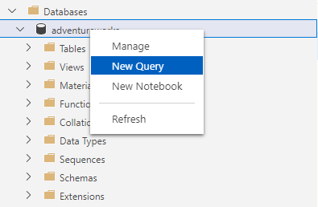

---
lab:
  title: Grundlegendes zum Sperren
  module: Understand concurrency in PostgreSQL
---

# Grundlegendes zum Sperren

In dieser Übung werden Sie sich Systemparameter und Metadaten in PostgreSQL ansehen.

## Vor der Installation

Sie benötigen ein eigenes Azure-Abonnement für die Übungen in diesem Modul. Wenn Sie kein Azure-Abonnement haben, können Sie unter [Cloudentwicklung dank kostenlosem Azure-Konto](https://azure.microsoft.com/free/) ein kostenloses Testkonto erstellen.

## Erstellen der Übungsumgebung

### Bereitstellen von Ressourcen in Ihrem Azure-Abonnement

Dieser Schritt führt Sie durch die Verwendung von Azure CLI-Befehlen aus der Azure Cloud Shell, um eine Ressourcengruppe zu erstellen und ein Bicep-Skript auszuführen, um die für diese Übung erforderlichen Azure-Services in Ihrem Azure-Abonnement bereitzustellen.

1. Öffnen Sie einen Webbrowser, und navigieren Sie zum [Azure-Portal](https://portal.azure.com/).

2. Wählen Sie das Symbol **Cloud Shell** in der Symbolleiste des Azure-Portals aus, um einen neuen [Cloud Shell](https://learn.microsoft.com/azure/cloud-shell/overview)-Bereich am unteren Rand Ihres Browserfensters zu öffnen.

    

    Wählen Sie bei Aufforderung die erforderlichen Optionen aus, um eine *Bash*-Shell zu öffnen. Wenn Sie zuvor eine *PowerShell*-Konsole verwendet haben, wechseln Sie zu einer *Bash*-Shell.

3. Geben Sie an der Cloud Shell-Eingabeaufforderung Folgendes ein, um das GitHub-Repository mit den Übungsressourcen zu klonen:

    ```bash
    git clone https://github.com/MicrosoftLearning/mslearn-postgresql.git
    ```

4. Als Nächstes führen Sie drei Befehle aus, um Variablen zu definieren und so die redundante Eingabe zu reduzieren, wenn Sie Azure-CLI-Befehle zum Erstellen von Azure-Ressourcen verwenden. Die Variablen stehen für den Namen, den Sie Ihrer Ressourcengruppe zuweisen (`RG_NAME`), für die Azure-Region (`REGION`), in der die Ressourcen bereitgestellt werden und für ein zufällig generiertes Kennwort für den PostgreSQL-Administrator-Login (`ADMIN_PASSWORD`).

    Im ersten Befehl ist die Region, die der entsprechenden Variablen zugewiesen ist, `eastus`, aber Sie können sie auch durch einen Ort Ihrer Wahl ersetzen.

    ```bash
    REGION=eastus
    ```

    Mit dem folgenden Befehl weisen Sie den Namen für die Ressourcengruppe zu, die alle in dieser Übung verwendeten Ressourcen enthalten wird. Der Name der Ressourcengruppe, der der entsprechenden Variablen zugewiesen ist, lautet `rg-learn-work-with-postgresql-$REGION`, wobei `$REGION` der Ort ist, den Sie oben angegeben haben. Sie können den Namen jedoch auch in einen anderen Namen für die Ressourcengruppe ändern, der Ihren Wünschen entspricht.

    ```bash
    RG_NAME=rg-learn-work-with-postgresql-$REGION
    ```

    Der letzte Befehl generiert nach dem Zufallsprinzip ein Kennwort für das PostgreSQL-Admin-Login. Kopieren Sie sie an einen sicheren Ort, damit Sie sie später verwenden können, um eine Verbindung zu Ihrem flexiblen PostgreSQL-Server herzustellen.

    ```bash
    a=()
    for i in {a..z} {A..Z} {0..9}; 
       do
       a[$RANDOM]=$i
    done
    ADMIN_PASSWORD=$(IFS=; echo "${a[*]::18}")
    echo "Your randomly generated PostgreSQL admin user's password is:"
    echo $ADMIN_PASSWORD
    ```

5. Wenn Sie Zugriff auf mehr als ein Azure-Abonnement haben und Ihr Standardabonnement nicht dasjenige ist, in dem Sie die Ressourcengruppe und andere Ressourcen für diese Übung erstellen möchten, führen Sie diesen Befehl aus, um das entsprechende Abonnement festzulegen. Ersetzen Sie dabei das Token `<subscriptionName|subscriptionId>` durch den Namen oder die ID des Abonnements, das Sie verwenden möchten:

    ```azurecli
    az account set --subscription <subscriptionName|subscriptionId>
    ```

6. Führen Sie den folgenden Azure CLI-Befehl aus, um Ihre Ressourcengruppe zu erstellen:

    ```azurecli
    az group create --name $RG_NAME --location $REGION
    ```

7. Verwenden Sie schließlich die Azure CLI, um ein Bicep-Bereitstellungsskript auszuführen, um Azure-Ressourcen in Ihrer Ressourcengruppe bereitzustellen:

    ```azurecli
    az deployment group create --resource-group $RG_NAME --template-file "mslearn-postgresql/Allfiles/Labs/Shared/deploy-postgresql-server.bicep" --parameters adminLogin=pgAdmin adminLoginPassword=$ADMIN_PASSWORD databaseName=adventureworks
    ```

    Das Bicep-Bereitstellungsskript stellt die für diese Übung erforderlichen Azure-Service in Ihrer Ressourcengruppe bereit. Die eingesetzten Ressourcen sind eine Azure-Datenbank für PostgreSQL – Flexibler Server. Das Bicep-Skript erstellt auch eine Datenbank, die in der Befehlszeile als Parameter konfiguriert werden kann.

    Die Bereitstellung dauert in der Regel mehrere Minuten. Sie können es von der Cloud Shell aus überwachen oder zur Seite **Bereitstellungen** für die oben erstellte Ressourcengruppe navigieren und dort den Bereitstellungsfortschritt beobachten.

8. Schließen Sie den Cloud Shell-Bereich, sobald Ihre Ressourcenbereitstellung abgeschlossen ist.

### Problembehandlung bei der Bereitstellung

Beim Ausführen des Bicep-Bereitstellungsskripts können einige Fehler auftreten. Die häufigsten Meldungen und die Schritte zu ihrer Behebung sind:

- Wenn Sie zuvor das Bicep-Bereitstellungsskript für diesen Lernpfad ausgeführt und anschließend die Ressourcen gelöscht haben, erhalten Sie möglicherweise eine Fehlermeldung wie die folgende, wenn Sie versuchen, das Skript innerhalb von 48 Stunden nach dem Löschen der Ressourcen erneut auszuführen:

    ```bash
    {"code": "InvalidTemplateDeployment", "message": "The template deployment 'deploy' is not valid according to the validation procedure. The tracking id is '4e87a33d-a0ac-4aec-88d8-177b04c1d752'. See inner errors for details."}
    
    Inner Errors:
    {"code": "FlagMustBeSetForRestore", "message": "An existing resource with ID '/subscriptions/{subscriptionId}/resourceGroups/rg-learn-postgresql-ai-eastus/providers/Microsoft.CognitiveServices/accounts/{accountName}' has been soft-deleted. To restore the resource, you must specify 'restore' to be 'true' in the property. If you don't want to restore existing resource, please purge it first."}
    ```

    Wenn Sie diese Meldung erhalten, ändern Sie den obigen Befehl `azure deployment group create`, um den Parameter `restore` auf `true` zu setzen und führen Sie ihn erneut aus.

- Wenn die ausgewählte Region für die Bereitstellung bestimmter Ressourcen eingeschränkt ist, müssen Sie die Variable `REGION` auf einen anderen Speicherort setzen und die Befehle erneut ausführen, um die Ressourcengruppe zu erstellen und das Bicep-Bereitstellungsskript auszuführen.

    ```bash
    {"status":"Failed","error":{"code":"DeploymentFailed","target":"/subscriptions/{subscriptionId}/resourceGroups/{resourceGrouName}/providers/Microsoft.Resources/deployments/{deploymentName}","message":"At least one resource deployment operation failed. Please list deployment operations for details. Please see https://aka.ms/arm-deployment-operations for usage details.","details":[{"code":"ResourceDeploymentFailure","target":"/subscriptions/{subscriptionId}/resourceGroups/{resourceGroupName}/providers/Microsoft.DBforPostgreSQL/flexibleServers/{serverName}","message":"The resource write operation failed to complete successfully, because it reached terminal provisioning state 'Failed'.","details":[{"code":"RegionIsOfferRestricted","message":"Subscriptions are restricted from provisioning in this region. Please choose a different region. For exceptions to this rule please open a support request with Issue type of 'Service and subscription limits'. See https://review.learn.microsoft.com/en-us/azure/postgresql/flexible-server/how-to-request-quota-increase for more details."}]}]}}
    ```

- Wenn das Skript aufgrund der Anforderung, die Vereinbarung über die verantwortungsvolle KI zu akzeptieren, keine KI-Ressource erstellen kann, kann der folgende Fehler auftreten. Verwenden Sie in diesem Fall die Benutzeroberfläche des Azure-Portals, um eine Azure-KI-Services-Ressource zu erstellen und führen Sie das Bereitstellungsskript dann erneut aus.

    ```bash
    {"code": "InvalidTemplateDeployment", "message": "The template deployment 'deploy' is not valid according to the validation procedure. The tracking id is 'f8412edb-6386-4192-a22f-43557a51ea5f'. See inner errors for details."}
     
    Inner Errors:
    {"code": "ResourceKindRequireAcceptTerms", "message": "This subscription cannot create TextAnalytics until you agree to Responsible AI terms for this resource. You can agree to Responsible AI terms by creating a resource through the Azure Portal then trying again. For more detail go to https://go.microsoft.com/fwlink/?linkid=2164190"}
    ```

## Verbinden Sie sich mit Ihrer Datenbank mit psql in der Azure Cloud Shell

In dieser Aufgabe stellen Sie eine Verbindung zur `adventureworks` Datenbank auf Ihrem Azure Database for PostgreSQL Server her, indem Sie das [psql Befehlszeilendienstprogramm](https://www.postgresql.org/docs/current/app-psql.html) aus der [Azure Cloud Shell](https://learn.microsoft.com/azure/cloud-shell/overview) verwenden.

1. Navigieren Sie im [Azure-Portal](https://portal.azure.com/) zu Ihrem neu erstellten Azure Database for PostgreSQL – Flexibler Server.

2. Wählen Sie im Ressourcenmenü unter **Einstellungen** die Option **Datenbanken** und dann **Verbinden** für die Datenbank `adventureworks`.

    

3. Geben Sie bei der Eingabeaufforderung „Kennwort für den Benutzer pgAdmin“ in der Cloud Shell das zufällig generierte Kennwort für die Anmeldung **pgAdmin** ein.

    Sobald Sie angemeldet sind, wird die Eingabeaufforderung `psql` für die Datenbank `adventureworks` angezeigt.

4. Im weiteren Verlauf dieser Übung arbeiten Sie weiterhin in der Cloud Shell. Daher kann es hilfreich sein, den Bereich in Ihrem Browserfenster zu erweitern, indem Sie die Schaltfläche **Maximieren** oben rechts im Bereich wählen.

    

### Auffüllen der Datenbank mit Daten

1. Sie müssen eine Tabelle in der Datenbank erstellen und sie mit Beispieldaten füllen, damit Sie Informationen haben, mit denen Sie arbeiten können, wenn Sie in dieser Übung das Sperren überprüfen.
1. Führen Sie den folgenden Befehl aus, um die Tabelle `production.workorder` für das Laden der Daten zu erstellen:

    ```sql
    DROP SCHEMA IF EXISTS production CASCADE;
    CREATE SCHEMA production;
    
    DROP TABLE IF EXISTS production.workorder;
    CREATE TABLE production.workorder
    (
        workorderid integer NOT NULL,
        productid integer NOT NULL,
        orderqty integer NOT NULL,
        scrappedqty smallint NOT NULL,
        startdate timestamp without time zone NOT NULL,
        enddate timestamp without time zone,
        duedate timestamp without time zone NOT NULL,
        scrapreasonid smallint,
        modifieddate timestamp without time zone NOT NULL DEFAULT now()
    )
    WITH (
        OIDS = FALSE
    )
    TABLESPACE pg_default;
    ```

1. Als nächstes verwenden Sie den Befehl `COPY`, um Daten aus CSV-Dateien in die oben erstellte Tabelle zu laden. Beginnen Sie, indem Sie den folgenden Befehl ausführen, um die Tabelle `production.workorder` aufzufüllen:

    ```sql
    \COPY production.workorder FROM 'mslearn-postgresql/Allfiles/Labs/08/Lab8_workorder.csv' CSV HEADER
    ```

    Die Befehlsausgabe sollte `COPY 72591` sein, was bedeutet, dass 72591 Zeilen aus der CSV-Datei in die Tabelle geschrieben wurden.

1. Schließen Sie das Cloud Shell-Fenster, sobald die Daten geladen sind.

### Herstellen einer Verbindung mit der Datenbank über Azure Data Studio

1. Wenn Sie Azure Data Studio noch nicht installiert haben, [laden Sie es herunter und installieren Sie ***Azure Data Studio***](https://go.microsoft.com/fwlink/?linkid=2282284).
1. Starten Sie Azure Data Studio.
1. Wenn Sie die Erweiterung **PostgreSQL** in Azure Data Studio noch nicht installiert haben, installieren Sie sie jetzt.
1. Wählen Sie **Server** und dann **Neue Verbindung** aus.
1. Wählen Sie unter **Verbindungstyp** die Option **PostgreSQL** aus.
1. Geben Sie unter **Servername** den Wert ein, den Sie bei der Serverbereitstellung angegeben haben.
1. In **Benutzername** geben Sie **pgAdmin** ein.
1. Geben Sie in **Kennwort** das zufällig generierte Kennwort für das **pgAdmin** Login ein, das Sie generiert haben
1. Klicken Sie auf **Kennwort speichern**.
1. Klicken Sie auf das Menü **Verbinden**

## Aufgabe 1: Untersuchen des Standardsperrverhaltens

1. Öffnen Sie Azure Data Studio.
1. Erweitern Sie **Datenbanken**, klicken Sie mit der rechten Maustaste auf **adventureworks**, und wählen Sie **Neue Abfrage** aus.
   
    

1. Gehen Sie auf **Datei** und **Neue Abfrage**. Sie sollten nun eine Abfrage-Registerkarte haben, deren Name mit **SQL_Query_1** beginnt und eine weitere Abfrage-Registerkarte, deren Name mit **SQL_Query_2** beginnt.
1. Wählen Sie die Registerkarte **SQLQuery_1** aus, geben Sie die folgende Abfrage ein, und klicken Sie auf **Ausführen**.

    ```sql
    SELECT * FROM production.workorder
    ORDER BY scrappedqty DESC;
    ```

1. Beachten Sie, dass der **scrappedqty** Wert für die erste Zeile **673** ist.
1. Wählen Sie die Registerkarte **SQLQuery_2** aus, geben Sie die folgende Abfrage ein, und klicken Sie auf **Ausführen**.

    ```sql
    BEGIN TRANSACTION;
    UPDATE production.workorder
        SET scrappedqty=scrappedqty+1;
    ```

1. Beachten Sie, dass die zweite Abfrage eine Transaktion startet, ohne diese Transaktion zu committen.
1. Kehren Sie zu **SQLQuery_1** zurück, und führen Sie die Abfrage erneut aus.
1. Beachten Sie, dass der Wert **stockedqty** für die erste Zeile immer noch **673** ist. Die Abfrage verwendet eine Momentaufnahme der Daten und kann die Updates der anderen Transaktion nicht ermitteln.
1. Wählen Sie die Registerkarte **SQLQuery_2** aus, löschen Sie die bestehende Abfrage, geben Sie die folgende Abfrage ein, und klicken Sie auf **Ausführen**.

    ```sql
    ROLLBACK TRANSACTION;
    ```

## Aufgabe 2: Anwenden von Tabellensperren auf eine Transaktion

1. Wählen Sie die Registerkarte **SQLQuery_2** aus, geben Sie die folgende Abfrage ein, und klicken Sie auf **Ausführen**.

    ```sql
    BEGIN TRANSACTION;
    LOCK TABLE production.workorder IN ACCESS EXCLUSIVE MODE;
    UPDATE production.workorder
        SET scrappedqty=scrappedqty+1;
    ```

1. Beachten Sie, dass die zweite Abfrage eine Transaktion startet, ohne diese Transaktion zu committen.
1. Kehren Sie zu **SQLQuery_1** zurück, und führen Sie die Abfrage erneut aus.
1. Beachten Sie, dass die Transaktion blockiert ist und nicht abgeschlossen wird, unabhängig davon, wie lange Sie warten.
1. Wählen Sie die Registerkarte **SQLQuery_2** aus, löschen Sie die bestehende Abfrage, geben Sie die folgende Abfrage ein, und klicken Sie auf **Ausführen**.

    ```sql
    ROLLBACK TRANSACTION;
    ```

1. Kehren Sie zu **SQLQuery_1** zurück, warten Sie ein paar Sekunden und stellen Sie fest, dass die Abfrage abgeschlossen ist, nachdem der Block entfernt wurde.

In dieser Übung wurde das Standardsperrverhalten vorgestellt. Anschließend haben Sie Sperren explizit angewendet und erfahren, dass einige Sperren die Leistung beeinträchtigen können, obwohl sie sehr hohe Schutzstufen bieten.

## Bereinigung der Übung

Für die Azure Database for PostgreSQL, die wir in dieser Übung eingesetzt haben, fallen Gebühren an. Sie können den Server nach dieser Übung löschen. Alternativ können Sie auch die Ressourcengruppe **rg-learn-work-with-postgresql-eastus** löschen, um alle Ressourcen zu entfernen, die wir im Rahmen dieser Übung bereitgestellt haben.
