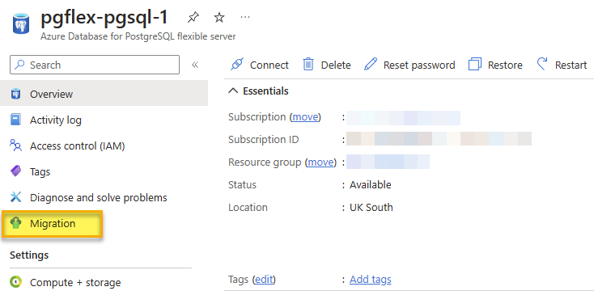

---
lab:
  title: Offline PostgreSQL Datenbank-Migration
  module: Migrate to Azure Database for PostgreSQL Flexible Server
---

# Offline PostgreSQL Datenbank-Migration

In dieser Übung erstellen Sie einen Azure Database for PostgreSQL – Flexibler Server und führen eine Offline-Datenbankmigration entweder von einem lokalen PostgreSQL-Server oder einem Azure Database for PostgreSQL-Server durch, indem Sie die Migrationsfunktion im Azure Database for PostgreSQL – Flexibler Server verwenden.

## Vor der Installation

Für diese Übung benötigen Sie ein eigenes Azure-Abonnement. Wenn Sie nicht über ein Azure-Abonnement verfügen, können Sie ein [kostenloses Azure-Testkonto](https://azure.microsoft.com/free) erstellen.

### Bearbeiten Sie die Datei pg_hba.conf, um die Konnektivität von Azure zu ermöglichen (überspringen Sie dies, wenn Sie nicht von einem externen PostgreSQL-Server migrieren)

> [!NOTE]
> In diesem Lab werden zwei Azure-Datenbanken für PostgreSQL erstellt, die als Quelle und Ziel für die Migration dienen. Wenn Sie jedoch Ihre eigene Umgebung verwenden, benötigen Sie zur Durchführung dieser Übung Zugang zu einem vorhandenen PostgreSQL-Server mit einer Datenbank, entsprechenden Berechtigungen und Netzwerkzugang.
> 
> Wenn Sie Ihre eigene Umgebung verwenden, ist es für diese Übung erforderlich, dass der Server, den Sie als Quelle für die Migration verwenden, für den Azure Database for PostgreSQL – Flexibler Server zugänglich ist, damit dieser eine Verbindung herstellen und Datenbanken migrieren kann. Dazu muss der Quellserver über eine öffentliche IP-Adresse und einen öffentlichen Port erreichbar sein. Eine Liste der IP-Adressen der Azure-Region können Sie unter [Azure IP-Bereiche und Service-Tags – Public Cloud](https://www.microsoft.com/en-gb/download/details.aspx?id=56519) herunterladen, um die zulässigen IP-Adressbereiche in Ihren Firewall-Regeln basierend auf der verwendeten Azure-Region zu minimieren. Öffnen Sie die Firewall Ihres Servers, um der Migrationsfunktion von Azure Database for PostgreSQL – Flexibler Server den Zugriff auf den PostgreSQL-Quellserver zu ermöglichen, der standardmäßig der TCP-Port **5432** ist.
>
> Wenn Sie eine Firewall-Appliance vor Ihrer Quelldatenbank verwenden, müssen Sie möglicherweise Firewall-Regeln hinzufügen, damit die Migrationsfunktion des Azure Database for PostgreSQL – Flexibler Server auf die Quelldatenbank(en) für die Migration zugreifen kann.
>
> Die maximal unterstützte Version von PostgreSQL für die Migration ist Version 16.

Auf dem PostgreSQL-Quellserver muss die Datei pg_hba.conf aktualisiert werden, um sicherzustellen, dass die Instanz Konnektivität vom Azure Database for PostgreSQL – Flexibler Server zulässt.

1. Sie fügen der Datei pg_hba.conf Einträge hinzu, um Verbindungen aus den Azure-IP-Bereichen zuzulassen. Die Einträge in pg_hba.conf legen fest, welche Hosts sich verbinden können, welche Datenbanken, welche Benutzenden und welche Authentifizierungsmethoden verwendet werden können.
1. Wenn Ihre Azure-Services zum Beispiel im IP-Bereich 104.45.0.0/16 liegen. Um allen Benutzenden die Verbindung zu allen Datenbanken aus diesem Bereich mit Kennwort-Authentifizierung zu ermöglichen, würden Sie Folgendes hinzufügen:

``` bash
host    all    all    104.45.0.0/16    md5
```

1. Wenn Verbindungen über das Internet zugelassen werden, auch von Azure aus, sollte sichergestellt werden, dass starke Authentifizierungsmechanismen vorhanden sind

- Verwenden Sie sichere Kennwörter.
- Beschränken Sie den Zugriff auf so wenige IP-Adressen wie möglich.
- Verwenden Sie ein VPN oder VNet: Wenn möglich, konfigurieren Sie ein Virtual Private Network (VPN) oder Azure Virtual Network (VNet), um einen sicheren Tunnel zwischen Azure und Ihrem PostgreSQL-Server zu schaffen.

1. Nach dem Speichern von Änderungen an pg_hba.conf müssen Sie die PostgreSQL-Konfiguration neu laden, damit die Änderungen mit einem SQL-Befehl innerhalb einer psql-Sitzung wirksam werden:

```sql
SELECT pg_reload_conf();
```

1. Testen Sie die Verbindung von Azure zu Ihrem lokalen PostgreSQL-Server, um sicherzustellen, dass die Konfiguration wie erwartet funktioniert. Sie können dies von einer Azure VM oder einem Dienst aus tun, der ausgehende Datenbankverbindungen unterstützt.

### Bereitstellen von Ressourcen in Ihrem Azure-Abonnement

Dieser Schritt führt Sie durch die Verwendung von Azure CLI-Befehlen aus der Azure Cloud Shell, um eine Ressourcengruppe zu erstellen und ein Bicep-Skript auszuführen, um die für diese Übung erforderlichen Azure-Services in Ihrem Azure-Abonnement bereitzustellen.

1. Öffnen Sie einen Webbrowser, und navigieren Sie zum [Azure-Portal](https://portal.azure.com/).

1. Wählen Sie das Symbol **Cloud Shell** in der Symbolleiste des Azure-Portals aus, um einen neuen [Cloud Shell](https://learn.microsoft.com/azure/cloud-shell/overview)-Bereich am unteren Rand Ihres Browserfensters zu öffnen.

    

    Wählen Sie bei Aufforderung die erforderlichen Optionen aus, um eine *Bash*-Shell zu öffnen. Wenn Sie zuvor eine *PowerShell*-Konsole verwendet haben, wechseln Sie zu einer *Bash*-Shell.

1. Geben Sie an der Cloud Shell-Eingabeaufforderung Folgendes ein, um das GitHub-Repository mit den Übungsressourcen zu klonen:

    ```bash
    git clone https://github.com/MicrosoftLearning/mslearn-postgresql.git
    ```

1. Als Nächstes führen Sie drei Befehle aus, um Variablen zu definieren und so die redundante Eingabe zu reduzieren, wenn Sie Azure-CLI-Befehle zum Erstellen von Azure-Ressourcen verwenden. Die Variablen stehen für den Namen, den Sie Ihrer Ressourcengruppe zuweisen (`RG_NAME`), für die Azure-Region (`REGION`), in der die Ressourcen bereitgestellt werden und für ein zufällig generiertes Kennwort für den PostgreSQL-Administrator-Login (`ADMIN_PASSWORD`).

    Im ersten Befehl ist die Region, die der entsprechenden Variablen zugewiesen ist, `eastus`, aber Sie können sie auch durch einen Ort Ihrer Wahl ersetzen.

    ```bash
    REGION=eastus
    ```

    Mit dem folgenden Befehl weisen Sie den Namen für die Ressourcengruppe zu, die alle in dieser Übung verwendeten Ressourcen enthalten wird. Der Name der Ressourcengruppe, der der entsprechenden Variablen zugewiesen ist, lautet `rg-learn-work-with-postgresql-$REGION`, wobei `$REGION` der Ort ist, den Sie oben angegeben haben. Sie können den Namen jedoch auch in einen anderen Namen für die Ressourcengruppe ändern, der Ihren Wünschen entspricht.

    ```bash
    RG_NAME=rg-learn-work-with-postgresql-$REGION
    ```

    Der letzte Befehl generiert nach dem Zufallsprinzip ein Kennwort für das PostgreSQL-Admin-Login. Stellen Sie sicher, dass Sie es an einen sicheren Ort kopieren, um es später für die Verbindung zu Ihrem flexiblen PostgreSQL-Server zu verwenden.

    ```bash
    a=()
    for i in {a..z} {A..Z} {0..9}; 
       do
       a[$RANDOM]=$i
    done
    ADMIN_PASSWORD=$(IFS=; echo "${a[*]::18}")
    echo "Your randomly generated PostgreSQL admin user's password is:"
    echo $ADMIN_PASSWORD
    ```

1. Wenn Sie Zugriff auf mehr als ein Azure-Abonnement haben und Ihr Standardabonnement nicht dasjenige ist, in dem Sie die Ressourcengruppe und andere Ressourcen für diese Übung erstellen möchten, führen Sie diesen Befehl aus, um das entsprechende Abonnement festzulegen. Ersetzen Sie dabei das Token `<subscriptionName|subscriptionId>` durch den Namen oder die ID des Abonnements, das Sie verwenden möchten:

    ```azurecli
    az account set --subscription <subscriptionName|subscriptionId>
    ```

1. Führen Sie den folgenden Azure CLI-Befehl aus, um Ihre Ressourcengruppe zu erstellen:

    ```azurecli
    az group create --name $RG_NAME --location $REGION
    ```

1. Verwenden Sie schließlich die Azure CLI, um ein Bicep-Bereitstellungsskript auszuführen, um Azure-Ressourcen in Ihrer Ressourcengruppe bereitzustellen:

    ```azurecli
    az deployment group create --resource-group $RG_NAME --template-file "mslearn-postgresql/Allfiles/Labs/Shared/deploy-postgresql-server-migration.bicep" --parameters adminLogin=pgAdmin adminLoginPassword=$ADMIN_PASSWORD databaseName=adventureworks
    ```

    Das Bicep-Bereitstellungsskript stellt die für diese Übung erforderlichen Azure-Service in Ihrer Ressourcengruppe bereit. Die bereitgestellten Ressourcen sind zwei Azure Database for PostgreSQL – Flexibler Server. Einen Quell- und einen Zielserver für die Migration.

    Die Bereitstellung dauert in der Regel einige Minuten (5–10+ Minuten). Sie können es von der Cloud Shell aus überwachen oder zur Seite **Bereitstellungen** für die oben erstellte Ressourcengruppe navigieren und dort den Bereitstellungsfortschritt beobachten.

1. Schließen Sie den Cloud Shell-Bereich, sobald Ihre Ressourcenbereitstellung abgeschlossen ist.

1. Überprüfen Sie im Azure-Portal die Namen der beiden neuen Azure Database for PostgreSQL-Server. Beachten Sie, dass bei der Auflistung der Datenbanken auf dem Quellserver die **adventureworks**-Datenbank enthalten ist, auf dem Zielserver jedoch nicht.

1. Wählen Sie unter dem Abschnitt **Netzwerke** von *beiden* Servern
    1. **+ Aktuelle IP-Adresse hinzufügen (xxx.xxx.xxx)** und **Speichern**.
    1. Aktivieren Sie das Kontrollkästchen **Öffentlichen Zugriff auf diesen Server über beliebigen Azure-Dienst in Azure gestatten**.
    1. Aktivieren Sie das Kontrollkästchen **Öffentlichen Zugriff auf diese Ressource über das Internet mit einer öffentlichen IP-Adresse zulassen**.

> [!NOTE]
> In einer Produktionsumgebung müssen Sie nur die Optionen, Netzwerke und IPs auswählen, die Sie für den Zugriff auf Ihre Azure Database for PostgreSQL-Server benötigen. 

> [!NOTE]
> Wie bereits erwähnt, wird dieses Bicep-Skript zwei Azure Database for PostgreSQL-Server erstellen, einen Quell- und einen Zielserver.  ***Wenn Sie einen lokalen PostgreSQL-Server in Ihrer Umgebung als Quellserver für dieses Lab verwenden, ersetzen Sie die Verbindungsinformationen des Quellservers in allen folgenden Anweisungen durch die Verbindungsinformationen Ihres lokalen Servers in Ihrer Umgebung***.  Stellen Sie sicher, dass Sie die erforderlichen Firewall-Regeln sowohl in Ihrer Umgebung als auch in Azure aktivieren.
    
### Problembehandlung bei der Bereitstellung

Beim Ausführen des Bicep-Bereitstellungsskripts können einige Fehler auftreten. Die häufigsten Meldungen und die Schritte zu ihrer Behebung sind:

- Wenn Sie zuvor das Bicep-Bereitstellungsskript für diesen Lernpfad ausgeführt und anschließend die Ressourcen gelöscht haben, erhalten Sie möglicherweise eine Fehlermeldung wie die folgende, wenn Sie versuchen, das Skript innerhalb von 48 Stunden nach dem Löschen der Ressourcen erneut auszuführen:

    ```bash
    {"code": "InvalidTemplateDeployment", "message": "The template deployment 'deploy' is not valid according to the validation procedure. The tracking id is '4e87a33d-a0ac-4aec-88d8-177b04c1d752'. See inner errors for details."}
    
    Inner Errors:
    {"code": "FlagMustBeSetForRestore", "message": "An existing resource with ID '/subscriptions/{subscriptionId}/resourceGroups/rg-learn-postgresql-ai-eastus/providers/Microsoft.CognitiveServices/accounts/{accountName}' has been soft-deleted. To restore the resource, you must specify 'restore' to be 'true' in the property. If you don't want to restore existing resource, please purge it first."}
    ```

    Wenn Sie diese Meldung erhalten, ändern Sie den obigen Befehl `azure deployment group create`, um den Parameter `restore` auf `true` zu setzen und führen Sie ihn erneut aus.

- Wenn die ausgewählte Region für die Bereitstellung bestimmter Ressourcen eingeschränkt ist, müssen Sie die Variable `REGION` auf einen anderen Speicherort setzen und die Befehle erneut ausführen, um die Ressourcengruppe zu erstellen und das Bicep-Bereitstellungsskript auszuführen.

    ```bash
    {"status":"Failed","error":{"code":"DeploymentFailed","target":"/subscriptions/{subscriptionId}/resourceGroups/{resourceGrouName}/providers/Microsoft.Resources/deployments/{deploymentName}","message":"At least one resource deployment operation failed. Please list deployment operations for details. Please see https://aka.ms/arm-deployment-operations for usage details.","details":[{"code":"ResourceDeploymentFailure","target":"/subscriptions/{subscriptionId}/resourceGroups/{resourceGrouName}/providers/Microsoft.DBforPostgreSQL/flexibleServers/{serverName}","message":"The resource write operation failed to complete successfully, because it reached terminal provisioning state 'Failed'.","details":[{"code":"RegionIsOfferRestricted","message":"Subscriptions are restricted from provisioning in this region. Please choose a different region. For exceptions to this rule please open a support request with Issue type of 'Service and subscription limits'. See https://review.learn.microsoft.com/en-us/azure/postgresql/flexible-server/how-to-request-quota-increase for more details."}]}]}}
    ```

- Wenn das Skript aufgrund der Anforderung, die Vereinbarung über die verantwortungsvolle KI zu akzeptieren, keine KI-Ressource erstellen kann, kann der folgende Fehler auftreten. Verwenden Sie in diesem Fall die Benutzeroberfläche des Azure-Portals, um eine Azure-KI-Services-Ressource zu erstellen und führen Sie das Bereitstellungsskript dann erneut aus.

    ```bash
    {"code": "InvalidTemplateDeployment", "message": "The template deployment 'deploy' is not valid according to the validation procedure. The tracking id is 'f8412edb-6386-4192-a22f-43557a51ea5f'. See inner errors for details."}
     
    Inner Errors:
    {"code": "ResourceKindRequireAcceptTerms", "message": "This subscription cannot create TextAnalytics until you agree to Responsible AI terms for this resource. You can agree to Responsible AI terms by creating a resource through the Azure Portal then trying again. For more detail go to https://go.microsoft.com/fwlink/?linkid=2164190"}
    ```

## Erstellen einer Datenbank, einer Tabelle und von Daten für die Migration

In diesem Lab haben Sie die Möglichkeit, von einem PostreSQL-Server vor Ort oder von einem Azure Database for PostgreSQL-Server zu migrieren. Folgen Sie den Anweisungen für den Typ des Servers, von dem Sie migrieren.

### Erstellen Sie eine Datenbank auf dem lokalen PostgreSQL-Server (Überspringen Sie dies, wenn Sie von einem Azure Database for PostgreSQL-Server migrieren).

Nun müssen wir die Datenbank einrichten, die Sie auf den Azure Database for PostgreSQL – Flexibler Server migrieren werden. Dieser Schritt muss auf Ihrer ursprünglichen PostgreSQL Serverinstanz ausgeführt werden, auf die der Azure Database for PostgreSQL – Flexibler Server zugreifen kann, damit Sie dieses Lab durchführen können.

Zunächst müssen wir eine leere Datenbank erstellen, in der wir eine Tabelle anlegen und sie dann mit Daten füllen. Zunächst müssen Sie die Dateien ***Lab10_setupTable.sql*** und ***Lab10_workorder.csv*** aus dem [Repository](https://github.com/MicrosoftLearning/mslearn-postgresql/tree/main/Allfiles/Labs/10) auf Ihr lokales Laufwerk herunterladen (zum Beispiel **C:\\**).
Sobald Sie diese Dateien haben, können wir die Datenbank mit dem folgenden Befehl erstellen. **Ersetzen Sie die Werte für host, port und username wie für Ihren PostgreSQL-Server erforderlich.**

```bash
psql --host=localhost --port=5432 --username=pgadmin --command="CREATE DATABASE adventureworks;"
```

Führen Sie den folgenden Befehl aus, um die Tabelle `production.workorder` für das Laden der Daten zu erstellen:

```sql
    DROP SCHEMA IF EXISTS production CASCADE;
    CREATE SCHEMA production;
    
    DROP TABLE IF EXISTS production.workorder;
    CREATE TABLE production.workorder
    (
        workorderid integer NOT NULL,
        productid integer NOT NULL,
        orderqty integer NOT NULL,
        scrappedqty smallint NOT NULL,
        startdate timestamp without time zone NOT NULL,
        enddate timestamp without time zone,
        duedate timestamp without time zone NOT NULL,
        scrapreasonid smallint,
        modifieddate timestamp without time zone NOT NULL DEFAULT now()
    )
    WITH (
        OIDS = FALSE
    )
    TABLESPACE pg_default;
    ALTER TABLE production.workorder OWNER to pgAdmin;
```

```sql
psql --host=localhost --port=5432 --username=postgres --dbname=adventureworks --command="\COPY production.workorder FROM 'C:\Lab10_workorder.csv' CSV HEADER"
```

Die Befehlsausgabe sollte `COPY 72101` lauten, was bedeutet, dass 72101 Zeilen aus der CSV-Datei in die Tabelle geschrieben wurden.

## Vor der Migration (Überspringen, wenn die Migration von einem Azure Database for PostgreSQL-Server erfolgt)

Bevor wir mit der Offline-Migration der Datenbank vom Quellserver beginnen, müssen wir sicherstellen, dass der Zielserver konfiguriert und bereit ist.

1. Migrieren Sie Benutzer und Rollen vom Quellserver auf den neuen Flexibler Server. Dies kann mit dem Tool pg_dumpall mit folgendem Code erreicht werden.
    1. Superuser-Rollen werden von Azure Database for PostgreSQL nicht unterstützt. Daher sollten alle Benutzenden mit diesen Rechten vor der Migration entfernt werden.

```bash
pg_dumpall --globals-only -U <<username>> -f <<filename>>.sql
```

1. Passen Sie die Serverparameterwerte vom Quellserver an den Zielserver an.
1. Deaktivieren Sie Hochverfügbarkeit und Read Replicas auf dem Ziel.

### Erstellen Sie eine Datenbank auf dem Azure Database for PostgreSQL-Server (Überspringen Sie diese, wenn Sie von einem lokalen PostgreSQL-Server migrieren).

Nun müssen wir die Datenbank einrichten, die Sie auf den Azure Database for PostgreSQL – Flexibler Server migrieren werden. Dieser Schritt muss auf Ihrer ursprünglichen PostgreSQL Serverinstanz ausgeführt werden, auf die der Azure Database for PostgreSQL – Flexibler Server zugreifen kann, damit Sie dieses Lab durchführen können.

Zunächst müssen wir eine leere Datenbank erstellen, in der wir eine Tabelle anlegen und sie dann mit Daten füllen. 

1. Navigieren Sie im [Azure Portal](https://portal.azure.com/) zu der neu erstellten Quelle Azure Database for PostgreSQL-Server (_**psql-learn-source**_-location-uniquevalue).

1. Wählen Sie im Ressourcenmenü unter **Einstellungen** die Option **Datenbanken** und dann **Verbinden** für die Datenbank `adventureworks`.

    

1. Geben Sie bei der Eingabeaufforderung „Kennwort für den Benutzer pgAdmin“ in der Cloud Shell das zufällig generierte Kennwort für die Anmeldung **pgAdmin** ein.

    Sobald Sie angemeldet sind, wird die Eingabeaufforderung `psql` für die Datenbank `adventureworks` angezeigt.

1. Führen Sie den folgenden Befehl aus, um die Tabelle `production.workorder` für das Laden der Daten zu erstellen:

    ```sql
        DROP SCHEMA IF EXISTS production CASCADE;
        CREATE SCHEMA production;
        
        DROP TABLE IF EXISTS production.workorder;
        CREATE TABLE production.workorder
        (
            workorderid integer NOT NULL,
            productid integer NOT NULL,
            orderqty integer NOT NULL,
            scrappedqty smallint NOT NULL,
            startdate timestamp without time zone NOT NULL,
            enddate timestamp without time zone,
            duedate timestamp without time zone NOT NULL,
            scrapreasonid smallint,
            modifieddate timestamp without time zone NOT NULL DEFAULT now()
        )
        WITH (
            OIDS = FALSE
        )
        TABLESPACE pg_default;
    ```

    ```sql
    \COPY production.workorder FROM 'mslearn-postgresql/Allfiles/Labs/10/Lab10_workorder.csv' CSV HEADER
    ```

    Die Befehlsausgabe sollte `COPY 72101` lauten, was bedeutet, dass 72101 Zeilen aus der CSV-Datei in die Tabelle geschrieben wurden.

1. Schließen Sie **Cloud Shell**.

## Datenbankmigrationsprojekt in Azure Database for PostgreSQL – Flexibler Server erstellen

1. Wählen Sie auf dem Zielserver **Migration** aus dem Menü auf der linken Seite des flexiblen Serverblatts.

   

1. Klicken Sie auf die Option **+ Erstellen** am oberen Rand des **Migration**-Blattes.
   > **Hinweis**: Wenn die Option **+ Erstellen** nicht verfügbar ist, wählen Sie **Compute und Speicher** und ändern Sie die Berechnungsebene entweder auf **Universell** oder **Arbeitsspeicheroptimiert** und versuchen Sie erneut, den Migrationsprozess zu erstellen. Nachdem die Migration erfolgreich war, können Sie die Berechnungsebene wieder auf **Burstfähig** ändern.
1. Auf der Registerkarte **Setup** geben Sie jedes Feld wie folgt ein:
    1. Migrationsname: **`Migration-AdventureWorks`**.
    1. Quellserver-Typ: Wählen Sie für dieses Lab, unabhängig davon, ob Sie eine Migration von On-Premise oder von einer Azure-Datenbank für PostgreSQL durchführen, **On-Premise Server**. In einer Produktionsumgebung wählen Sie den richtigen Quellserver-Typ.
    1. Migrationsoption: **Validieren und Migrieren**.
    1. Migrationsmodus: **Offline**. 
    1. Wählen Sie **Nächste: Wählen Sie Runtime Server >**.
    1. Wählen Sie **Nein** für *Laufzeitserver verwenden*.
    1. Wählen Sie **Verbinden mit Quelle >**.

    

1. Für die Migration von einer Azure-Datenbank für PostgreSQL: Auf der Registerkarte **Verbindung zur Quelle** geben Sie jedes Feld wie folgt ein:
    1. Servername: Die Adresse Ihres Servers, den Sie als Quelle verwenden.
    1. Port: Der Port, den Ihre PostgreSQL-Instanz auf Ihrem Quellserver verwendet (Standardwert: 5432).
    1. Server-Admin Login-Name: Der Name eines Admin-Benutzenden für Ihre PostgreSQL-Instanz (standardmäßig pgAdmin).
    1. Kennwort: Das Kennwort für den PostgreSQL-Admin-Benutzenden, den Sie im vorherigen Schritt angegeben haben.
    1. SSL-Modus: Bevorzugt.
    1. Klicken Sie auf die Option **Verbindung zur Quelle herstellen**, um die angegebenen Verbindungsdetails zu bestätigen.
    1. Klicken Sie auf die Schaltfläche **Weiter: Migrationsziel auswählen**, um fortzufahren.

1. Die Angaben zur Konnektivität sollten für den Zielserver, auf den wir migrieren, automatisch ausgefüllt werden.
    1. Kennwort-Feld: Geben Sie das zufällig generierte Kennwort für das **pgAdmin**-Login ein, das Sie mit dem Bicep-Skript erstellt haben.
    1. Klicken Sie auf die Option **Verbinden mit dem Ziel**, um die angegebenen Verbindungsdetails zu bestätigen.
    1. Klicken Sie auf die Schaltfläche **Weiter: Datenbank(en) für die Migration auswählen >**, um fortzufahren.
1. Wählen Sie auf der Registerkarte **Datenbank(en) für die Migration auswählen** die **adventureworks** von dem Quellserver, den Sie auf den flexiblen Server migrieren möchten.

    

1. Klicken Sie auf die Schaltfläche **Weiter: Zusammenfassung >**, um fortzufahren und die angegebenen Daten zu überprüfen.
1. Überprüfen Sie auf der Registerkarte **Zusammenfassung** die Informationen und klicken Sie dann auf die Schaltfläche **Validierung und Migration starten**, um die Migration zum flexiblen Server zu starten.
1. Auf der Registerkarte **Migration** können Sie den Fortschritt der Migration überwachen, indem Sie die Schaltfläche **Aktualisieren** im oberen Menü verwenden, um den Fortschritt des Validierungs- und Migrationsprozesses zu sehen.
    1. Wenn Sie auf die Aktivität **Migration-AdventureWorks** klicken, können Sie detaillierte Informationen über den Fortschritt der Migrationsaktivität einsehen.
1. Sobald die Migration abgeschlossen ist, überprüfen Sie den Zielserver. Sie sollten nun die **adventureworks**-Datenbank auch unter diesem Server finden.

Sobald der Migrationsprozess abgeschlossen ist, können wir Aufgaben nach der Migration durchführen, z. B. die Datenvalidierung in der neuen Datenbank und die Konfiguration der Hochverfügbarkeit, bevor wir die Anwendung auf die Datenbank richten und sie wieder einschalten.

## Bereinigung der Übung

Die Azure-Datenbank für PostgreSQL, die wir in dieser Übung bereitgestellt haben, wird in der nächsten Übung verwendet. Es fallen Gebühren an, damit Sie den Server nach dieser Übung anhalten können. Alternativ können Sie auch die Ressourcengruppe **rg-learn-work-with-postgresql-eastus** löschen, um alle Ressourcen zu entfernen, die wir im Rahmen dieser Übung bereitgestellt haben. Das bedeutet, dass Sie die Schritte in dieser Übung wiederholen müssen, um die nächste Übung abzuschließen.
