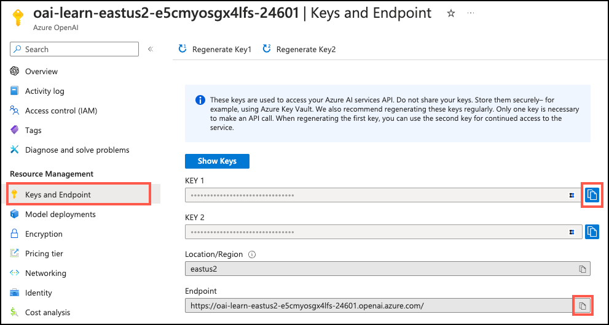

---
lab:
  title: Erkunden der Azure KI-Erweiterung
  module: Explore Generative AI with Azure Database for PostgreSQL
---

# Erkunden der Azure KI-Erweiterung

Im Rahmen Ihrer Tätigkeit als Leitung der Entwicklung für Margie's Travel wurden Sie mit der Entwicklung einer KI-gestützten Anwendung beauftragt, die Ihrer Kundschaft intelligente Empfehlungen zu Mietobjekten geben soll. Sie möchten mehr über die `azure_ai`-Erweiterung für Azure Database for PostgreSQL erfahren und darüber, wie Sie die Leistungsfähigkeit von generativer KI (GenAI) in Ihre App integrieren können. In dieser Übung erkunden Sie die `azure_ai`-Erweiterung und ihre Funktionalität, indem Sie sie in eine flexible Azure Database for PostgreSQL-Server-Datenbank installieren und ihre Möglichkeiten zur Integration von Azure KI- und ML-Diensten untersuchen.

## Vor der Installation

Hierfür benötigen Sie ein [Azure-Abonnement](https://azure.microsoft.com/free) mit Administratorrechten.

### Bereitstellen von Ressourcen in Ihrem Azure-Abonnement

Dieser Schritt führt Sie durch die Verwendung von Azure CLI-Befehlen aus der Azure Cloud Shell, um eine Ressourcengruppe zu erstellen und ein Bicep-Skript auszuführen, um die Azure-Dienste bereitzustellen, die zum Abschließen dieser Übung in Ihrem Azure-Abonnement erforderlich sind.

1. Öffnen Sie einen Webbrowser, und navigieren Sie zum [Azure-Portal](https://portal.azure.com/).

2. Wählen Sie das Symbol **Cloud Shell** in der Symbolleiste des Azure-Portals aus, um einen neuen [Cloud Shell](https://learn.microsoft.com/azure/cloud-shell/overview)-Bereich am unteren Rand Ihres Browserfensters zu öffnen.

    

    Wählen Sie bei Aufforderung die erforderlichen Optionen aus, um eine *Bash*-Shell zu öffnen. Wenn Sie zuvor eine *PowerShell*-Konsole verwendet haben, wechseln Sie zu einer *Bash*-Shell.

3. Geben Sie an der Cloud Shell-Eingabeaufforderung Folgendes ein, um das GitHub-Repository mit den Übungsressourcen zu klonen:

    ```bash
    git clone https://github.com/MicrosoftLearning/mslearn-postgresql.git
    ```

4. Als Nächstes führen Sie drei Befehle aus, um Variablen zu definieren und so die redundante Eingabe zu reduzieren, wenn Sie Azure-CLI-Befehle zum Erstellen von Azure-Ressourcen verwenden. Die Variablen stehen für den Namen, den Sie Ihrer Ressourcengruppe zuweisen (`RG_NAME`), für die Azure-Region (`REGION`), in der die Ressourcen bereitgestellt werden, und für ein zufällig generiertes Kennwort für den PostgreSQL-Admin-Login (`ADMIN_PASSWORD`).

    Im ersten Befehl ist die der entsprechenden Variablen zugewiesene Region `eastus`, aber Sie können sie auch durch einen Ort Ihrer Voreinstellung ersetzen. Wenn Sie jedoch die Standardeinstellung ersetzen, müssen Sie eine andere [Azure-Region auswählen, die die abstrakte Zusammenfassung unterstützt](https://learn.microsoft.com/azure/ai-services/language-service/summarization/region-support), um sicherzustellen, dass Sie alle Aufgaben in den Modulen in diesem Lernpfad erledigen können.

    ```bash
    REGION=eastus
    ```

    Mit dem folgenden Befehl weisen Sie den Namen für die Ressourcengruppe zu, die alle in dieser Übung verwendeten Ressourcen enthalten wird. Der Name der Ressourcengruppe, die der entsprechenden Variablen zugewiesen ist, lautet `rg-learn-postgresql-ai-$REGION`, wobei `$REGION` der Speicherort ist, den Sie oben angegeben haben. Sie können ihn jedoch in einen beliebigen anderen Ressourcengruppennamen ändern, der Ihren Vorstellungen entspricht.

    ```bash
    RG_NAME=rg-learn-postgresql-ai-$REGION
    ```

    Der letzte Befehl generiert nach dem Zufallsprinzip ein Kennwort für das PostgreSQL-Admin-Login. Kopieren Sie es an einen sicheren Ort, der später verwendet werden kann, wenn Sie eine Verbindung mit Ihrem flexiblen PostgreSQL-Server herstellen.

    ```bash
    a=()
    for i in {a..z} {A..Z} {0..9};
        do
        a[$RANDOM]=$i
        done
    ADMIN_PASSWORD=$(IFS=; echo "${a[*]::18}")
    echo "Your randomly generated PostgreSQL admin user's password is:"
    echo $ADMIN_PASSWORD
    ```

5. Wenn Sie Zugriff auf mehr als ein Azure-Abonnement haben und Ihr Standardabonnement nicht das Abonnement ist, in dem Sie die Ressourcengruppe und andere Ressourcen für diese Übung erstellen möchten, führen Sie diesen Befehl aus, um das entsprechende Abonnement festzulegen, und ersetzen Sie dabei das Token `<subscriptionName|subscriptionId>` durch den Namen oder die ID des Abonnements, das Sie verwenden möchten:

    ```azurecli
    az account set --subscription <subscriptionName|subscriptionId>
    ```

6. Führen Sie den folgenden Azure CLI-Befehl aus, um Ihre Ressourcengruppe zu erstellen:

    ```azurecli
    az group create --name $RG_NAME --location $REGION
    ```

7. Verwenden Sie schließlich die Azure CLI, um ein Bicep-Bereitstellungsskript auszuführen, um Azure-Ressourcen in Ihrer Ressourcengruppe bereitzustellen:

    ```azurecli
    az deployment group create --resource-group $RG_NAME --template-file "mslearn-postgresql/Allfiles/Labs/Shared/deploy.bicep" --parameters restore=false adminLogin=pgAdmin adminLoginPassword=$ADMIN_PASSWORD
    ```

    Das Bicep-Bereitstellungsskript stellt die Azure-Dienste bereit, die zum Abschließen dieser Übung in Ihrer Ressourcengruppe erforderlich sind. Die bereitgestellten Ressourcen umfassen einen flexiblen Azure Database for PostgreSQL-Server, Azure OpenAI und ein Azure KI Language-Dienst. Das Bicep-Skript führt auch einige Konfigurationsschritte aus, wie z. B. das Hinzufügen der Erweiterungen `azure_ai` und `vector` zur _Positivliste_ des PostgreSQL-Servers (über den Serverparameter azure.extensions), das Erstellen einer Datenbank mit dem Namen `rentals` auf dem Server und das Hinzufügen einer Bereitstellung mit dem Namen `embedding` unter Verwendung des Modells `text-embedding-ada-002` zu Ihrem Azure OpenAI-Service. Beachten Sie, dass die Bicep-Datei von allen Modulen in diesem Lernpfad gemeinsam genutzt wird, sodass Sie möglicherweise nur einige der bereitgestellten Ressourcen in einigen Übungen verwenden.

    Die Bereitstellung dauert in der Regel mehrere Minuten. Sie können es von der Cloud Shell aus überwachen oder zur Seite **Bereitstellungen** für die oben erstellte Ressourcengruppe navigieren und dort den Bereitstellungsfortschritt beobachten.

 8. Schließen Sie den Cloud Shell-Bereich, sobald die Ressourcenbereitstellung abgeschlossen ist.
 
### Problembehandlung bei der Bereitstellung

Beim Ausführen des Bicep-Bereitstellungsskripts treten möglicherweise einige Fehler auf.

- Wenn Sie zuvor das Bicep-Bereitstellungsskript für diesen Lernpfad ausgeführt und anschließend die Ressourcen gelöscht haben, erhalten Sie möglicherweise eine Fehlermeldung wie die folgende, wenn Sie versuchen, das Skript innerhalb von 48 Stunden nach dem Löschen der Ressourcen erneut auszuführen:

    ```bash
    {"code": "InvalidTemplateDeployment", "message": "The template deployment 'deploy' is not valid according to the validation procedure. The tracking id is '4e87a33d-a0ac-4aec-88d8-177b04c1d752'. See inner errors for details."}
    
    Inner Errors:
    {"code": "FlagMustBeSetForRestore", "message": "An existing resource with ID '/subscriptions/{subscriptionId}/resourceGroups/rg-learn-postgresql-ai-eastus/providers/Microsoft.CognitiveServices/accounts/{accountName}' has been soft-deleted. To restore the resource, you must specify 'restore' to be 'true' in the property. If you don't want to restore existing resource, please purge it first."}
    ```

    Wenn Sie diese Meldung erhalten, ändern Sie den obigen Befehl `azure deployment group create`, um den Parameter `restore` auf `true` zu setzen, und führen Sie ihn erneut aus.

- Wenn die Bereitstellung bestimmter Ressourcen in der ausgewählten Region eingeschränkt ist, müssen Sie die Variable `REGION` auf einen anderen Speicherort festlegen und die Befehle erneut ausführen, um die Ressourcengruppe zu erstellen und das Bicep-Bereitstellungsskript auszuführen.

    ```bash
    {"status":"Failed","error":{"code":"DeploymentFailed","target":"/subscriptions/{subscriptionId}/resourceGroups/{resourceGrouName}/providers/Microsoft.Resources/deployments/{deploymentName}","message":"At least one resource deployment operation failed. Please list deployment operations for details. Please see https://aka.ms/arm-deployment-operations for usage details.","details":[{"code":"ResourceDeploymentFailure","target":"/subscriptions/{subscriptionId}/resourceGroups/{resourceGrouName}/providers/Microsoft.DBforPostgreSQL/flexibleServers/{serverName}","message":"The resource write operation failed to complete successfully, because it reached terminal provisioning state 'Failed'.","details":[{"code":"RegionIsOfferRestricted","message":"Subscriptions are restricted from provisioning in this region. Please choose a different region. For exceptions to this rule please open a support request with Issue type of 'Service and subscription limits'. See https://review.learn.microsoft.com/en-us/azure/postgresql/flexible-server/how-to-request-quota-increase for more details."}]}]}}
    ```

- Wenn das Skript aufgrund der Anforderung, die Vereinbarung über die verantwortungsvolle KI zu akzeptieren, keine KI-Ressource erstellen kann, kann der folgende Fehler auftreten. Verwenden Sie in diesem Fall die Benutzeroberfläche des Azure-Portals, um eine Azure KI Services-Ressource zu erstellen, und führen Sie das Bereitstellungsskript dann erneut aus.

    ```bash
    {"code": "InvalidTemplateDeployment", "message": "The template deployment 'deploy' is not valid according to the validation procedure. The tracking id is 'f8412edb-6386-4192-a22f-43557a51ea5f'. See inner errors for details."}
     
    Inner Errors:
    {"code": "ResourceKindRequireAcceptTerms", "message": "This subscription cannot create TextAnalytics until you agree to Responsible AI terms for this resource. You can agree to Responsible AI terms by creating a resource through the Azure Portal then trying again. For more detail go to https://go.microsoft.com/fwlink/?linkid=2164190"}
    ```

## Herstellen einer Verbindung mit der Datenbank mithilfe von psql in Azure Cloud Shell

Bei dieser Aufgabe stellen Sie über das [psql-Befehlszeilenprogramm](https://www.postgresql.org/docs/current/app-psql.html) aus der [Azure Cloud Shell](https://learn.microsoft.com/azure/cloud-shell/overview) eine Verbindung zur `rentals`-Datenbank auf Ihrem flexiblen Azure Database for PostgreSQL-Server her.

1. Navigieren Sie im [Azure-Portal](https://portal.azure.com/) zu Ihrem neu erstellten flexiblen Azure Database for PostgreSQL-Server.

2. Wählen Sie im Ressourcenmenü unter **Einstellungen** die Option **Datenbanken** und wählen Sie **Verbinden** für die Datenbank `rentals`.

    

3. Geben Sie beim Prompt „Kennwort für den Benutzer pgAdmin“ in der Cloud Shell das zufällig generierte Kennwort für die **pgAdmin**-Anmeldung ein.

    Sobald Sie angemeldet sind, wird der `psql`-Prompt für die `rentals`-Datenbank angezeigt.

4. Im weiteren Verlauf dieser Übung arbeiten Sie weiterhin in der Cloud Shell. Daher kann es hilfreich sein, den Bereich in Ihrem Browserfenster zu erweitern, indem Sie die Schaltfläche **Maximieren** oben rechts im Bereich wählen.

    

## Füllen der Datenbank mit Beispieldaten

Bevor Sie sich mit der `azure_ai`-Erweiterung befassen, fügen Sie der `rentals`-Datenbank einige Tabellen hinzu und füllen sie mit Beispieldaten, damit Sie bei der Überprüfung der Funktionalität der Erweiterung mit Informationen arbeiten können.

1. Führen Sie die folgenden Befehle aus, um die Tabellen `listings` und `reviews` zu erstellen, in denen die Daten für die Auflistung der Mietobjekte und die Bewertungen der Kundschaft gespeichert werden:

    ```sql
    DROP TABLE IF EXISTS listings;
    
    CREATE TABLE listings (
      id int,
      name varchar(100),
      description text,
      property_type varchar(25),
      room_type varchar(30),
      price numeric,
      weekly_price numeric
    );
    ```

    ```sql
    DROP TABLE IF EXISTS reviews;
    
    CREATE TABLE reviews (
      id int,
      listing_id int, 
      date date,
      comments text
    );
    ```

2. Als Nächstes verwenden Sie den Befehl `COPY`, um Daten aus CSV-Dateien in jede Tabelle zu laden, die Sie oben erstellt haben. Beginnen Sie, indem Sie den folgenden Befehl ausführen, um die Tabelle `listings` aufzufüllen:

    ```sql
    \COPY listings FROM 'mslearn-postgresql/Allfiles/Labs/Shared/listings.csv' CSV HEADER
    ```

    Die Befehlsausgabe sollte `COPY 50` lauten, was bedeutet, dass 50 Zeilen aus der CSV-Datei in die Tabelle geschrieben wurden.

3. Führen Sie schließlich den folgenden Befehl aus, um die Bewertungen der Kundschaft in die Tabelle `reviews` zu laden:

    ```sql
    \COPY reviews FROM 'mslearn-postgresql/Allfiles/Labs/Shared/reviews.csv' CSV HEADER
    ```

    Die Befehlsausgabe sollte `COPY 354` lauten, was bedeutet, dass 354 Zeilen aus der CSV-Datei in die Tabelle geschrieben wurden.

## Installieren und Konfigurieren der `azure_ai`-Erweiterung

Bevor Sie die `azure_ai`-Erweiterung verwenden, müssen Sie sie in Ihrer Datenbank installieren und konfigurieren, um eine Verbindung mit Ihren Azure KI Services-Ressourcen herzustellen. Die `azure_ai`-Erweiterung ermöglicht es Ihnen, die Dienste Azure OpenAI und Azure KI Language in Ihre Datenbank zu integrieren. Um die Erweiterung in Ihrer Datenbank zu aktivieren, führen Sie die folgenden Schritte aus:

1. Führen Sie den folgenden Befehl beim `psql`-Prompt aus, um zu überprüfen, ob die Erweiterungen `azure_ai` und `vector` erfolgreich zur _Positivliste_ Ihres Servers hinzugefügt wurden, und zwar durch das Bicep-Bereitstellungsskript, das Sie ausgeführt haben, als Sie Ihre Umgebung einrichteten:

    ```sql
    SHOW azure.extensions;
    ```

    Der Befehl zeigt die Liste der Erweiterungen in der _Positivliste_ des Servers an. Wenn alles richtig installiert wurde, muss Ihre Ausgabe `azure_ai` und `vector` enthalten, wie hier dargestellt:

    ```sql
     azure.extensions 
    ------------------
     azure_ai,vector
    ```

    Bevor eine Erweiterung in einer flexiblen Serverdatenbank von Azure Database for PostgreSQL installiert und verwendet werden kann, muss sie zur _Positivliste_ des Servers hinzugefügt werden, wie in [Verwendung von PostgreSQL-Erweiterungen](https://learn.microsoft.com/azure/postgresql/flexible-server/concepts-extensions#how-to-use-postgresql-extensions) beschrieben.

2. Jetzt können Sie die `azure_ai`-Erweiterung mit dem Befehl [CREATE EXTENSION](https://www.postgresql.org/docs/current/sql-createextension.html) installieren.

    ```sql
    CREATE EXTENSION IF NOT EXISTS azure_ai;
    ```

    `CREATE EXTENSION` lädt eine neue Erweiterung in die Datenbank, indem die Skriptdatei ausgeführt wird. Dieses Skript erstellt in der Regel neue SQL-Objekte wie Funktionen, Datentypen und Schemata. Wenn bereits eine Erweiterung desselben Namens vorhanden ist, wird ein Fehler ausgelöst. Durch Hinzufügen von `IF NOT EXISTS` kann der Befehl ausgeführt werden, ohne dass eine Fehlermeldung ausgegeben wird, wenn er bereits installiert ist.

## Überprüfen der Objekte, die in der `azure_ai`-Erweiterung enthalten sind

Durch die Überprüfung der Objekte in der `azure_ai`-Erweiterung können Sie deren Funktionen besser verstehen. In dieser Aufgabe untersuchen Sie die verschiedenen Schemata, benutzerdefinierten Funktionen (USER-Defined Functions, UDFs) und zusammengesetzte Typen, die der Datenbank durch die Erweiterung hinzugefügt wurden.

1. Bei der Arbeit mit `psql` in der Cloud Shell kann es hilfreich sein, die erweiterte Anzeige für Abfrageergebnisse zu aktivieren, da dies die Lesbarkeit der Ausgabe für nachfolgende Befehle verbessert. Führen Sie den folgenden Befehl aus, damit die erweiterte Anzeige automatisch angewendet werden kann.

    ```sql
    \x auto
    ```

2. Der [`\dx`-Metabefehl](https://www.postgresql.org/docs/current/app-psql.html#APP-PSQL-META-COMMAND-DX-LC) wird zum Auflisten von Objekten verwendet, die in einer Erweiterung enthalten sind. Führen Sie Folgendes in der `psql`-Eingabeaufforderung aus, um die Objekte in der `azure_ai`-Erweiterung anzuzeigen. Möglicherweise müssen Sie die Leertaste drücken, um die vollständige Liste der Objekte anzuzeigen.

    ```psql
    \dx+ azure_ai
    ```

    Die Ausgabe des Metabefehls zeigt, dass die `azure_ai`-Erweiterung vier Schemata, mehrere benutzerdefinierte Funktionen (UDFs), mehrere zusammengesetzte Typen in der Datenbank und die `azure_ai.settings`-Tabelle erstellt. Abgesehen von den Schemata werden allen Objektnamen das Schema vorangestellt, zu dem sie gehören. Schemata werden verwendet, um zusammengehörige Funktionen und Typen zu gruppieren, die die Erweiterung in Buckets einfügt. In der folgenden Tabelle sind die durch die Erweiterung hinzugefügten Schemata aufgeführt und kurz beschrieben:

    | Schema      | Beschreibung                                              |
    | ----------------- | ------------------------------------------------------------------------------------------------------ |
    | `azure_ai`    | Das Hauptschema, in dem sich die Konfigurationstabelle und die UDFs für die Interaktion mit der Erweiterung befinden. |
    | `azure_openai`  | Enthält die UDFs, die das Aufrufen eines Azure OpenAI-Endpunkts ermöglichen.                    |
    | `azure_cognitive` | Stellt UDFs und zusammengesetzte Typen im Zusammenhang mit der Integration der Datenbank in Azure KI Services bereit.     |
    | `azure_ml`    | Enthält die UDFs für die Integration von Azure Machine Learning (ML)-Diensten.                |

### Erkunden des Azure KI-Schemas

Das `azure_ai`-Schema stellt das Framework für die direkte Interaktion mit Azure KI- und ML-Diensten aus Ihrer Datenbank bereit. Es enthält Funktionen zum Einrichten von Verbindungen zu diesen Diensten und zum Abrufen dieser Verbindungen aus der `settings`-Tabelle, die ebenfalls im selben Schema gehostet wird. Die `settings`-Tabelle stellt sicheren Speicher in der Datenbank für Endpunkte und Schlüssel bereit, die Ihren Azure AI- und ML-Diensten zugeordnet sind.

1. Um die in einem Schema definierten Funktionen zu überprüfen, können Sie den [`\df`-Metabefehl](https://www.postgresql.org/docs/current/app-psql.html#APP-PSQL-META-COMMAND-DF-LC) verwenden und das Schema angeben, dessen Funktionen angezeigt werden sollen. Führen Sie Folgendes aus, um die Funktionen im `azure_ai`-Schema anzuzeigen:

    ```sql
    \df azure_ai.*
    ```

    Die Ausgabe des Befehls sollte eine Tabelle ähnlich dieser sein:

    ```sql
                  List of functions
     Schema |  Name  | Result data type | Argument data types | Type 
    ----------+-------------+------------------+----------------------+------
     azure_ai | get_setting | text      | key text      | func
     azure_ai | set_setting | void      | key text, value text | func
     azure_ai | version  | text      |           | func
    ```

    Mit der `set_setting()`-Funktion können Sie den Endpunkt und den Schlüssel Ihrer Azure-KI- und ML-Dienste festlegen, damit die Erweiterung eine Verbindung zu ihnen herstellen kann. Es akzeptiert einen **Schlüssel** und den **Wert**, der ihm zugewiesen werden soll. Die `azure_ai.get_setting()` Funktion bietet eine Möglichkeit zum Abrufen der Werte, die Sie mit der `set_setting()` Funktion festgelegt haben. Es akzeptiert den **Schlüssel** der Einstellung, die Sie anzeigen möchten, und gibt den ihm zugewiesenen Wert zurück. Für beide Methoden muss der Schlüssel eine der folgenden Sein:

    | Schlüssel | Beschreibung |
    | --- | ----------- |
    | `azure_openai.endpoint` | Ein unterstützter OpenAI-Endpunkt (z. B. <https://example.openai.azure.com>). |
    | `azure_openai.subscription_key` | Ein Abonnementschlüssel für eine Azure OpenAI-Ressource. |
    | `azure_cognitive.endpoint` | Ein unterstützter Azure KI Services-Endpunkt (z. B. <https://example.cognitiveservices.azure.com>). |
    | `azure_cognitive.subscription_key` | Ein Abonnementschlüssel für eine Azure KI Services-Ressource. |
    | `azure_ml.scoring_endpoint` | Ein unterstützter Azure ML-Bewertungsendpunkt (z. B. <https://example.eastus2.inference.ml.azure.com/score>). |
    | `azure_ml.endpoint_key` | Ein Endpunktschlüssel für eine Azure ML-Bereitstellung. |

    > Wichtig
    >
    > Da die Verbindungsinformationen für Azure KI Services, einschließlich API-Schlüssel, in einer Konfigurationstabelle in der Datenbank gespeichert sind, definiert die `azure_ai`-Erweiterung eine Rolle namens `azure_ai_settings_manager`, um sicherzustellen, dass diese Informationen geschützt sind und nur für Benutzende zugänglich sind, denen diese Rolle zugewiesen wurde. Diese Rolle ermöglicht das Lesen und Schreiben von Einstellungen im Zusammenhang mit der Erweiterung. Nur Mitglieder der `azure_ai_settings_manager`-Rolle können die Funktionen `azure_ai.get_setting()` und `azure_ai.set_setting()` aufrufen. In einem flexiblen Azure Database for PostgreSQL-Server wird allen Admin-Benutzenden (denen die Rolle `azure_pg_admin` zugewiesen ist) auch die Rolle `azure_ai_settings_manager` zugewiesen.

2. Um zu zeigen, wie Sie die Funktionen `azure_ai.set_setting()` und `azure_ai.get_setting()` verwenden, konfigurieren Sie die Verbindung zu Ihrem Azure OpenAI-Konto. Verwenden Sie dieselbe Browser-Registerkarte, in der Ihre Cloud Shell geöffnet ist, minimieren oder stellen Sie den Cloud Shell-Bereich wieder her und navigieren Sie dann zu Ihrer Azure OpenAI-Ressource im [Azure-Portal](https://portal.azure.com/). Sobald Sie sich auf der Azure OpenAI-Ressourcenseite befinden, wählen Sie im Ressourcenmenü im Abschnitt **Ressourcenverwaltung** die Option **Schlüssel und Endpunkt** aus und kopieren Sie dann Ihren Endpunkt und einen der verfügbaren Schlüssel.

    

    Sie können `KEY 1` oder `KEY 2` verwenden. Wenn Sie jederzeit zwei Schlüssel zur Verfügung haben, können Sie die Schlüssel auf sichere Weise rotieren und neu generieren, ohne Dienstunterbrechungen zu verursachen.

3. Sobald Sie Ihren Endpunkt und Schlüssel haben, maximieren Sie den Cloud Shell-Bereich erneut und fügen Sie dann mit den folgenden Befehlen Ihre Werte zur Konfigurationstabelle hinzu. Stellen Sie sicher, dass Sie die Token `{endpoint}` und `{api-key}` durch die Werte ersetzen, die Sie aus dem Azure-Portal kopiert haben.

    ```sql
    SELECT azure_ai.set_setting('azure_openai.endpoint', '{endpoint}');
    ```

    ```sql
    SELECT azure_ai.set_setting('azure_openai.subscription_key', '{api-key}');
    ```

4. Sie können die in der `azure_ai.settings`-Tabelle festgelegten Einstellungen mit der `azure_ai.get_setting()`-Funktion in den folgenden Abfragen überprüfen:

    ```sql
    SELECT azure_ai.get_setting('azure_openai.endpoint');
    SELECT azure_ai.get_setting('azure_openai.subscription_key');
    ```

    Die `azure_ai`-Erweiterung ist nun mit Ihrem Azure OpenAI-Konto verbunden.

### Überprüfen des Azure OpenAI-Schemas

Das `azure_openai`-Schema bietet die Möglichkeit, die Erstellung von Vektoreinbettungen von Textwerten mithilfe von Azure OpenAI in Ihre Datenbank zu integrieren. Mit diesem Schema können Sie [Einbettungen mit Azure OpenAI](https://learn.microsoft.com/azure/ai-services/openai/how-to/embeddings) direkt aus der Datenbank generieren, um Vektordarstellungen von Eingabetexten zu erstellen, die dann in Vektorähnlichkeitssuchen verwendet und von Modellen für maschinelles Lernen genutzt werden können. Das Schema enthält eine einzige Funktion, `create_embeddings()`, mit zwei Überladungen. Eine Überladung akzeptiert eine einzelne Eingabezeichenfolge, und die andere erwartet ein Array von Eingabezeichenfolgen.

1. Wie oben können Sie den [`\df`-Metabefehl](https://www.postgresql.org/docs/current/app-psql.html#APP-PSQL-META-COMMAND-DF-LC) verwenden, um die Details der Funktionen im `azure_openai`-Schema anzuzeigen:

    ```sql
    \df azure_openai.*
    ```

    Die Ausgabe zeigt die beiden Überladungen der `azure_openai.create_embeddings()`-Funktion, sodass Sie die Unterschiede zwischen den beiden Versionen der Funktion und den zurückgegebenen Typen überprüfen können. Die `Argument data types`-Eigenschaft in der Ausgabe zeigt die Liste der Argumente, die die beiden Funktionsüberladungen erwarten:

    | Argument    | Typ       | Standard | Beschreibung                                                          |
    | --------------- | ------------------ | ------- | ------------------------------------------------------------------------------------------------------------------------------ |
    | deployment_name | `text`      |    | Name der Bereitstellung in Azure OpenAI Studio, das das `text-embedding-ada-002`-Modell enthält.               |
    | input     | `text` oder `text[]` |    | Eingabetext (oder Array von Text), für den Einbettungen erstellt werden.                                |
    | batch_size   | `integer`     | 100  | Nur für die Überladung, die eine Eingabe von `text[]` erwartet. Gibt die Anzahl der gleichzeitig zu verarbeitenden Datensätze an.          |
    | timeout_ms   | `integer`     | 3600000 | Timeout in Millisekunden, nach dem der Vorgang beendet wird.                                 |
    | throw_on_error | `boolean`     | true  | Flag, das angibt, ob die Funktion beim Fehler eine Ausnahme auslösen soll, was zu einem Rollback der Umbruchtransaktionen führt. |
    | max_attempts  | `integer`     | 1   | Anzahl der Wiederholungen des Aufrufs an den Azure OpenAI-Dienst im Falle eines Fehlers.                     |
    | retry_delay_ms | `integer`     | 1.000  | Die Zeit (in Millisekunden), die gewartet werden muss, bevor versucht wird, den Azure OpenAI-Dienstendpunkt erneut aufzurufen.        |

2. Um ein vereinfachtes Beispiel für die Verwendung der Funktion zu geben, führen Sie die folgende Abfrage aus, die eine Vektoreinbettung für das Feld `description` in der Tabelle `listings` erstellt. Der `deployment_name`-Parameter in der Funktion ist auf `embedding` festgelegt, was dem Namen der Bereitstellung des `text-embedding-ada-002`-Modells in Ihrem Azure OpenAI-Dienst entspricht (es wurde mit diesem Namen vom Bicep-Bereitstellungsskript erstellt):

    ```sql
    SELECT
        id,
        name,
        azure_openai.create_embeddings('embedding', description) AS vector
    FROM listings
    LIMIT 1;
    ```

    Die Ausgabe sieht in etwa wie folgt aus:

    ```sql
     id |      name       |              vector
    ----+-------------------------------+------------------------------------------------------------
      1 | Stylish One-Bedroom Apartment | {0.020068742,0.00022734122,0.0018286322,-0.0064167166,...}
    ```

    Aus Platzgründen werden die Vektoreinbettungen in der obigen Ausgabe abgekürzt.

    [Einbettungen](https://learn.microsoft.com/azure/postgresql/flexible-server/generative-ai-overview#embeddings) sind ein Konzept des maschinellen Lernens und der Verarbeitung natürlicher Sprache (NLP), bei dem Objekte wie Wörter, Dokumente oder Entitäten als [Vektoren](https://learn.microsoft.com/azure/postgresql/flexible-server/generative-ai-overview#vectors) in einem mehrdimensionalen Raum dargestellt werden. Durch Einbettungen können Modelle des maschinellen Lernens bewerten, wie eng zwei Informationen miteinander verbunden sind. Diese Technik identifiziert effizient Beziehungen und Ähnlichkeiten zwischen Daten und ermöglicht es Algorithmen, Muster zu erkennen und präzise Vorhersagen zu treffen.

    Mit der `azure_ai` Erweiterung können Sie Einbettungen für Eingabetext generieren. Damit die generierten Vektoren zusammen mit den übrigen Daten in der Datenbank gespeichert werden können, müssen Sie die `vector` Erweiterung installieren, indem Sie den Anweisungen in der Dokumentation [ Vektorunterstützung in Ihrer Datenbank aktivieren ](https://learn.microsoft.com/azure/postgresql/flexible-server/how-to-use-pgvector#enable-extension) folgen. Dies liegt jedoch außerhalb des Umfangs dieser Übung.

### Untersuchen des azure_cognitive-Schemas

Das `azure_cognitive`-Schema stellt das Framework für die direkte Interaktion mit Azure KI Services aus Ihrer Datenbank bereit. Die Azure KI Services-Integrationen im Schema bieten eine Vielzahl von KI-Sprachfunktionen, auf die direkt von der Datenbank aus zugegriffen werden kann. Zu den Funktionen gehören Stimmungsanalyse, Spracherkennung, Schlüsselbegriffserkennung, Entitätserkennung, Textzusammenfassung und Übersetzung. Der Zugriff auf diese Funktionen wird über den [Azure KI Language-Dienst](https://learn.microsoft.com/azure/ai-services/language-service/overview) aktiviert.

1. Um alle in einem Schema definierten Funktionen zu überprüfen, können Sie den [`\df`-Metabefehl](https://www.postgresql.org/docs/current/app-psql.html#APP-PSQL-META-COMMAND-DF-LC) wie zuvor verwenden. Führen Sie Folgendes aus, um die Funktionen im `azure_cognitive`-Schema anzuzeigen:

    ```sql
    \df azure_cognitive.*
    ```

2. In diesem Schema sind zahlreiche Funktionen definiert, sodass die Ausgabe des [`\df`-Metabefehls](https://www.postgresql.org/docs/current/app-psql.html#APP-PSQL-META-COMMAND-DF-LC) schwer lesbar sein kann, daher empfiehlt es sich, sie in kleinere Abschnitte aufzuteilen. Führen Sie Folgendes aus, um nur die `analyze_sentiment()`-Funktion zu betrachten:

    ```sql
    \df azure_cognitive.analyze_sentiment
    ```

    Beachten Sie in der Ausgabe, dass die Funktion drei Überladungen hat, wobei eine einzelne Eingabezeichenfolge und die anderen beiden erwarteten Textarrays akzeptiert werden. Die Ausgabe zeigt das Schema, den Namen, den Ergebnisdatentyp und die Argumentdatentypen an. Diese Informationen können Ihnen helfen, zu verstehen, wie sie die Funktion verwenden.

3. Wiederholen Sie den obigen Befehl, indem Sie den Funktionsnamen `analyze_sentiment` durch jeden der folgenden Funktionsnamen ersetzen, um alle verfügbaren Funktionen im Schema zu prüfen:

   - `detect_language`
   - `extract_key_phrases`
   - `linked_entities`
   - `recognize_entities`
   - `recognize_pii_entities`
   - `summarize_abstractive`
   - `summarize_extractive`
   - `translate`

    Prüfen Sie für jede Funktion die verschiedenen Formen der Funktion sowie die erwarteten Eingaben und resultierenden Datentypen.

4. Neben Funktionen enthält das `azure_cognitive`-Schema auch mehrere zusammengesetzte Typen, die als Rückgabedatentypen aus den verschiedenen Funktionen verwendet werden. Es ist zwingend erforderlich, die Struktur des Datentyps zu verstehen, den eine Funktion zurückgibt, damit Sie die Ausgabe in Ihren Abfragen ordnungsgemäß verarbeiten können. Führen Sie beispielsweise den folgenden Befehl aus, um den `sentiment_analysis_result`-Typ zu überprüfen:

    ```sql
    \dT+ azure_cognitive.sentiment_analysis_result
    ```

5. Die Ausgabe des obigen Befehls zeigt, dass der `sentiment_analysis_result`-Typ ein `tuple` ist. Sie können die Struktur des `tuple`-Vorgangs weiter untersuchen, indem Sie den folgenden Befehl ausführen, um die Spalten im `sentiment_analysis_result`-Typ anzuzeigen:

    ```sql
    \d+ azure_cognitive.sentiment_analysis_result
    ```

    Die Ausgabe des Befehls sollte in etwa wie folgt aussehen:

    ```sql
             Composite type "azure_cognitive.sentiment_analysis_result"
       Column  |   Type   | Collation | Nullable | Default | Storage | Description 
    ----------------+------------------+-----------+----------+---------+----------+-------------
     sentiment   | text      |     |     |    | extended | 
     positive_score | double precision |     |     |    | plain  | 
     neutral_score | double precision |     |     |    | plain  | 
     negative_score | double precision |     |     |    | plain  |
    ```

    Der `azure_cognitive.sentiment_analysis_result` ist ein zusammengesetzter Typ, der die Stimmungsvorhersagen des eingegebenen Textes enthält. Er enthält die Stimmung, die positiv, negativ, neutral oder gemischt sein kann, und die Bewertungen für positive, neutrale und negative Aspekte im Text. Die Ergebnisse werden als reale Zahlen zwischen 0 und 1 dargestellt. Beispielsweise ist die Stimmung in (neutral, 0,26, 0,64, 0,09) neutral, mit einem positiven Ergebnis von 0,26, neutral von 0,64 und negativ bei 0,09.

6. Wie bei den `azure_openai`-Funktionen müssen Sie den Endpunkt und einen Schlüssel für Ihren Azure KI Language Service bereitstellen, um erfolgreich Aufrufe für Azure KI Services mithilfe der `azure_ai`-Erweiterung zu tätigen. Verwenden Sie dieselbe Browser-Registerkarte, in der Cloud Shell geöffnet ist, minimieren oder stellen Sie den Cloud Shell-Bereich wieder her und navigieren Sie dann zu Ihrer Sprachdienstressource im [Azure-Portal](https://portal.azure.com/). Wählen Sie im Ressourcenmenü im Abschnitt **Ressourcenverwaltung** die Option **Schlüssel und Endpunkt** aus.

    

7. Kopieren Sie Ihre Endpunkt- und Zugriffsschlüsselwerte und ersetzen Sie die Token `{endpoint}` und `{api-key}` durch die Werte, die Sie aus dem Azure-Portal kopiert haben. Maximieren Sie die Cloud Shell erneut, und führen Sie die Befehle an der Eingabeaufforderung in der `psql`-Cloud Shell aus, um Ihre Werte zur Konfigurationstabelle hinzuzufügen.

    ```sql
    SELECT azure_ai.set_setting('azure_cognitive.endpoint', '{endpoint}');
    ```

    ```sql
    SELECT azure_ai.set_setting('azure_cognitive.subscription_key', '{api-key}');
    ```

8. Führen Sie nun die folgende Abfrage aus, um die Stimmung einiger Rezensionen zu analysieren:

    ```sql
    SELECT
        id,
        comments,
        azure_cognitive.analyze_sentiment(comments, 'en') AS sentiment
    FROM reviews
    WHERE id IN (1, 3);
    ```

    Beobachten Sie die `sentiment`-Werte in der Ausgabe `(mixed,0.71,0.09,0.2)` und `(positive,0.99,0.01,0)`. Diese stellen die `sentiment_analysis_result` von der `analyze_sentiment()`-Funktion in der obigen Abfrage zurückgegebenen Werte dar. Die Analyse wurde über das `comments`-Feld in der `reviews`-Tabelle durchgeführt.

## Überprüfen des Azure ML-Schemas

Mit dem `azure_ml`-Schema können Funktionen eine direkte Verbindung mit Azure ML-Diensten aus Ihrer Datenbank herstellen.

1. Um die in einem Schema definierten Funktionen zu überprüfen, können Sie den [`\df`-Metabefehl](https://www.postgresql.org/docs/current/app-psql.html#APP-PSQL-META-COMMAND-DF-LC) verwenden. Führen Sie Folgendes aus, um die Funktionen im `azure_ml`-Schema anzuzeigen:

    ```sql
    \df azure_ml.*
    ```

    Beachten Sie, dass in der Ausgabe zwei Funktionen in diesem Schema definiert sind, `azure_ml.inference()` und `azure_ml.invoke()`, deren Details unten angezeigt werden:

    ```sql
                  List of functions
    -----------------------------------------------------------------------------------------------------------
    Schema       | azure_ml
    Name        | inference
    Result data type  | jsonb
    Argument data types | input_data jsonb, deployment_name text DEFAULT NULL::text, timeout_ms integer DEFAULT NULL::integer, throw_on_error boolean DEFAULT true, max_attempts integer DEFAULT 1, retry_delay_ms integer DEFAULT 1000
    Type        | func
    ```

    Die `inference()`-Funktion verwendet ein trainiertes Machine-Learning-Modell, um basierend auf neuen, nicht sichtbaren Daten Ergebnisse vorherzusagen oder zu generieren.

    Indem Sie einen Endpunkt und einen Schlüssel bereitstellen, können Sie eine Verbindung mit einem bereitgestellten Azure ML-Endpunkt herstellen, z. B. mit Ihren Azure OpenAI- und Azure KI Services-Endpunkten. Für die Interaktion mit Azure ML ist ein trainiertes und bereitgestelltes Modell erforderlich, sodass es für diese Übung nicht infrage kommt und Sie diese Verbindung nicht einrichten, um es hier auszuprobieren.

## Bereinigung

Nachdem Sie diese Übung abgeschlossen haben, löschen Sie die Azure-Ressourcen, die Sie erstellt haben. Die Abrechnung basiert auf der konfigurierten Kapazität und nicht auf der Verwendung der Datenbank. Befolgen Sie diese Anweisungen, um Ihre Ressourcengruppe und alle Ressourcen zu löschen, die Sie für diese Übung erstellt haben.

1. Öffnen Sie einen Webbrowser und navigieren Sie zum [Azure-Portal](https://portal.azure.com/). Wählen Sie auf der Startseite **Ressourcengruppen** unter Azure-Dienste aus.

    

2. Geben Sie in das Suchfeld für ein beliebiges Feld den Namen der Ressourcengruppe ein, die Sie für dieses Lab erstellt haben, und wählen Sie dann Ihre Ressourcengruppe aus der Liste aus.

3. Wählen Sie auf der Seite **Übersicht** der Ressourcengruppe die Option **Ressourcengruppe löschen** aus.

    

4. Geben Sie im Bestätigungsdialogfeld den Namen der Ressourcengruppe ein, die Sie löschen möchten, und wählen Sie dann **Löschen** aus.
