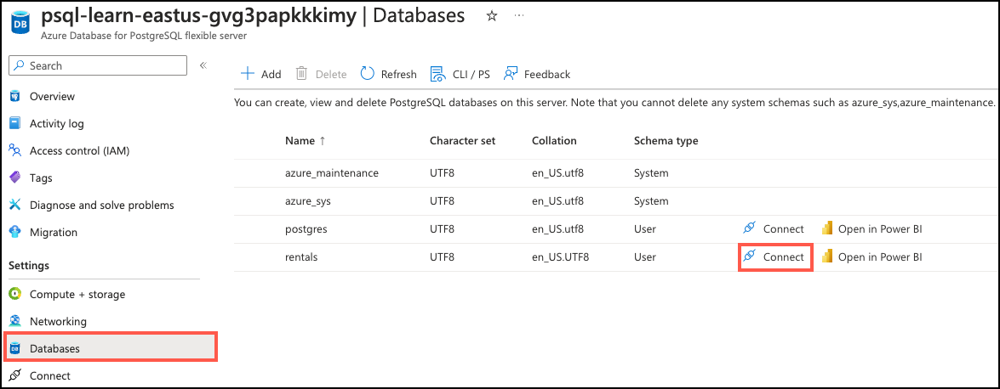
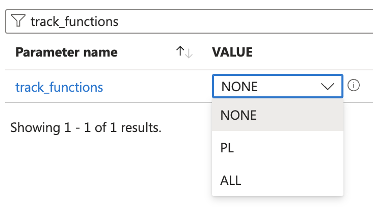

---
lab:
  title: Erstellen einer Suchfunktion für ein Empfehlungssystem
  module: Enable Semantic Search with Azure Database for PostgreSQL
---

# Erstellen einer Suchfunktion für ein Empfehlungssystem

Lassen Sie uns ein Empfehlungssystem mit semantischer Suche erstellen. Das System schlägt Ihnen mehrere Angebote vor, die auf einem bereitgestellten Musterangebot basieren. Das Beispiel könnte aus dem Angebot stammen, das die Nutzenden gerade ansehen, oder aus deren Präferenzen. Wir werden das System als PostgreSQL-Funktion implementieren und dabei die `azure_openai`-Erweiterung nutzen.

Am Ende dieser Übung werden Sie eine Funktion `recommend_listing` definiert haben, die höchstens `numResults` Auflistungen liefert, die der gelieferten `sampleListingId` am ähnlichsten sind. Sie können diese Daten nutzen, um neue Möglichkeiten zu erschließen, z. B. indem Sie empfohlene Angebote mit vergünstigten Angeboten vergleichen.

## Vor der Installation

Sie benötigen ein [Azure-Abonnement](https://azure.microsoft.com/free) mit administrativen Rechten und müssen für den Azure OpenAI-Zugang in diesem Abonnement zugelassen sein. Wenn Sie Zugriff auf Azure OpenAI benötigen, bewerben Sie sich auf der Seite [Eingeschränkter Zugriff auf Azure OpenAI](https://learn.microsoft.com/legal/cognitive-services/openai/limited-access).

### Bereitstellen von Ressourcen in Ihrem Azure-Abonnement

Dieser Schritt führt Sie durch die Verwendung von Azure CLI-Befehlen aus der Azure Cloud Shell, um eine Ressourcengruppe zu erstellen und ein Bicep-Skript auszuführen, um die für diese Übung erforderlichen Azure-Services in Ihrem Azure-Abonnement bereitzustellen.

1. Öffnen Sie einen Webbrowser, und navigieren Sie zum [Azure-Portal](https://portal.azure.com/).

2. Wählen Sie das Symbol **Cloud Shell** in der Symbolleiste des Azure-Portals aus, um einen neuen [Cloud Shell](https://learn.microsoft.com/azure/cloud-shell/overview)-Bereich am unteren Rand Ihres Browserfensters zu öffnen.

    

    Wählen Sie bei Aufforderung die erforderlichen Optionen aus, um eine *Bash*-Shell zu öffnen. Wenn Sie zuvor eine *PowerShell*-Konsole verwendet haben, wechseln Sie zu einer *Bash*-Shell.

3. Geben Sie an der Cloud Shell-Eingabeaufforderung Folgendes ein, um das GitHub-Repository mit den Übungsressourcen zu klonen:

    ```bash
    git clone https://github.com/MicrosoftLearning/mslearn-postgresql.git
    ```

4. Als Nächstes führen Sie drei Befehle aus, um Variablen zu definieren und so die redundante Eingabe zu reduzieren, wenn Sie Azure-CLI-Befehle zum Erstellen von Azure-Ressourcen verwenden. Die Variablen stehen für den Namen, den Sie Ihrer Ressourcengruppe zuweisen (`RG_NAME`), für die Azure-Region (`REGION`), in der die Ressourcen bereitgestellt werden und für ein zufällig generiertes Kennwort für den PostgreSQL-Administrator-Login (`ADMIN_PASSWORD`).

    Im ersten Befehl ist die Region, die der entsprechenden Variablen zugewiesen ist, `eastus`, aber Sie können sie auch durch einen Ort Ihrer Wahl ersetzen. Wenn Sie jedoch die Standardeinstellung ersetzen, müssen Sie eine andere [Azure-Region auswählen, die die abstrakte Zusammenfassung unterstützt](https://learn.microsoft.com/azure/ai-services/language-service/summarization/region-support), um sicherzustellen, dass Sie alle Aufgaben in den Modulen in diesem Lernpfad erledigen können.

    ```bash
    REGION=eastus
    ```

    Mit dem folgenden Befehl weisen Sie den Namen für die Ressourcengruppe zu, die alle in dieser Übung verwendeten Ressourcen enthalten wird. Der Name der Ressourcengruppe, der der entsprechenden Variablen zugewiesen ist, lautet `rg-learn-postgresql-ai-$REGION`, wobei `$REGION` der Ort ist, den Sie oben angegeben haben. Sie können den Namen jedoch auch in einen anderen Namen für die Ressourcengruppe ändern, der Ihren Wünschen entspricht.

    ```bash
    RG_NAME=rg-learn-postgresql-ai-$REGION
    ```

    Der letzte Befehl generiert nach dem Zufallsprinzip ein Kennwort für das PostgreSQL-Admin-Login. **Stellen Sie sicher, dass Sie sie** an einen sicheren Ort kopieren, um sie später für die Verbindung mit Ihrem PostgreSQL – Flexibler Server zu verwenden.

    ```bash
    a=()
    for i in {a..z} {A..Z} {0..9}; 
     do
     a[$RANDOM]=$i
    done
    ADMIN_PASSWORD=$(IFS=; echo "${a[*]::18}")
    echo "Your randomly generated PostgreSQL admin user's password is:"
    echo $ADMIN_PASSWORD
    ```

5. Wenn Sie Zugriff auf mehr als ein Azure-Abonnement haben und Ihr Standardabonnement nicht dasjenige ist, in dem Sie die Ressourcengruppe und andere Ressourcen für diese Übung erstellen möchten, führen Sie diesen Befehl aus, um das entsprechende Abonnement festzulegen. Ersetzen Sie dabei das Token `<subscriptionName|subscriptionId>` durch den Namen oder die ID des Abonnements, das Sie verwenden möchten:

    ```azurecli
    az account set --subscription <subscriptionName|subscriptionId>
    ```

6. Führen Sie den folgenden Azure CLI-Befehl aus, um Ihre Ressourcengruppe zu erstellen:

    ```azurecli
    az group create --name $RG_NAME --location $REGION
    ```

7. Verwenden Sie schließlich die Azure CLI, um ein Bicep-Bereitstellungsskript auszuführen, um Azure-Ressourcen in Ihrer Ressourcengruppe bereitzustellen:

    ```azurecli
    az deployment group create --resource-group $RG_NAME --template-file "mslearn-postgresql/Allfiles/Labs/Shared/deploy.bicep" --parameters restore=false adminLogin=pgAdmin adminLoginPassword=$ADMIN_PASSWORD
    ```

    Das Bicep-Bereitstellungsskript stellt die für diese Übung erforderlichen Azure-Service in Ihrer Ressourcengruppe bereit. Zu den bereitgestellten Ressourcen gehören eine Azure Database for PostgreSQL – Flexibler Server, Azure OpenAI und ein Azure KI Language-Service. Das Bicep-Skript führt auch einige Konfigurationsschritte aus, wie z. B. das Hinzufügen der `azure_ai`- und `vector`-Erweiterungen zur _Positivliste_ des PostgreSQL-Servers (über den `azure.extensions`-Server-Parameter), das Erstellen einer Datenbank mit dem Namen `rentals` auf dem Server und das Hinzufügen einer Bereitstellung mit dem Namen `embedding` unter Verwendung des `text-embedding-ada-002`-Modells zu Ihrem Azure OpenAI Service. Beachten Sie, dass die Bicep-Datei von allen Modulen in diesem Lernpfad gemeinsam genutzt wird, sodass Sie möglicherweise nur einige der bereitgestellten Ressourcen in einigen Übungen verwenden.

    Die Bereitstellung dauert in der Regel mehrere Minuten. Sie können es von der Cloud Shell aus überwachen oder zur Seite **Bereitstellungen** für die oben erstellte Ressourcengruppe navigieren und dort den Bereitstellungsfortschritt beobachten.

8. Schließen Sie den Cloud Shell-Bereich, sobald Ihre Ressourcenbereitstellung abgeschlossen ist.

### Problembehandlung bei der Bereitstellung

Beim Ausführen des Bicep-Bereitstellungsskripts können einige Fehler auftreten.

- Wenn Sie zuvor das Bicep-Bereitstellungsskript für diesen Lernpfad ausgeführt und anschließend die Ressourcen gelöscht haben, erhalten Sie möglicherweise eine Fehlermeldung wie die folgende, wenn Sie versuchen, das Skript innerhalb von 48 Stunden nach dem Löschen der Ressourcen erneut auszuführen:

    ```bash
    {"code": "InvalidTemplateDeployment", "message": "The template deployment 'deploy' is not valid according to the validation procedure. The tracking id is '4e87a33d-a0ac-4aec-88d8-177b04c1d752'. See inner errors for details."}
    
    Inner Errors:
    {"code": "FlagMustBeSetForRestore", "message": "An existing resource with ID '/subscriptions/{subscriptionId}/resourceGroups/rg-learn-postgresql-ai-eastus/providers/Microsoft.CognitiveServices/accounts/{accountName}' has been soft-deleted. To restore the resource, you must specify 'restore' to be 'true' in the property. If you don't want to restore existing resource, please purge it first."}
    ```

    Wenn Sie diese Meldung erhalten, ändern Sie den obigen Befehl `azure deployment group create`, um den Parameter `restore` auf `true` zu setzen und führen Sie ihn erneut aus.

- Wenn die ausgewählte Region für die Bereitstellung bestimmter Ressourcen eingeschränkt ist, müssen Sie die Variable `REGION` auf einen anderen Speicherort setzen und die Befehle erneut ausführen, um die Ressourcengruppe zu erstellen und das Bicep-Bereitstellungsskript auszuführen.

    ```bash
    {"status":"Failed","error":{"code":"DeploymentFailed","target":"/subscriptions/{subscriptionId}/resourceGroups/{resourceGrouName}/providers/Microsoft.Resources/deployments/{deploymentName}","message":"At least one resource deployment operation failed. Please list deployment operations for details. Please see https://aka.ms/arm-deployment-operations for usage details.","details":[{"code":"ResourceDeploymentFailure","target":"/subscriptions/{subscriptionId}/resourceGroups/{resourceGrouName}/providers/Microsoft.DBforPostgreSQL/flexibleServers/{serverName}","message":"The resource write operation failed to complete successfully, because it reached terminal provisioning state 'Failed'.","details":[{"code":"RegionIsOfferRestricted","message":"Subscriptions are restricted from provisioning in this region. Please choose a different region. For exceptions to this rule please open a support request with Issue type of 'Service and subscription limits'. See https://review.learn.microsoft.com/en-us/azure/postgresql/flexible-server/how-to-request-quota-increase for more details."}]}]}}
    ```

- Wenn das Skript aufgrund der Anforderung, die Vereinbarung über die verantwortungsvolle KI zu akzeptieren, keine KI-Ressource erstellen kann, kann der folgende Fehler auftreten. Verwenden Sie in diesem Fall die Benutzeroberfläche des Azure-Portals, um eine Azure-KI-Services-Ressource zu erstellen und führen Sie das Bereitstellungsskript dann erneut aus.

    ```bash
    {"code": "InvalidTemplateDeployment", "message": "The template deployment 'deploy' is not valid according to the validation procedure. The tracking id is 'f8412edb-6386-4192-a22f-43557a51ea5f'. See inner errors for details."}
     
    Inner Errors:
    {"code": "ResourceKindRequireAcceptTerms", "message": "This subscription cannot create TextAnalytics until you agree to Responsible AI terms for this resource. You can agree to Responsible AI terms by creating a resource through the Azure Portal then trying again. For more detail go to https://go.microsoft.com/fwlink/?linkid=2164190"}
    ```

## Verbinden Sie sich mit Ihrer Datenbank mit psql in der Azure Cloud Shell

In dieser Aufgabe stellen Sie eine Verbindung zur `rentals`-Datenbank auf Ihrem Azure Database for PostgreSQL-Server her, indem Sie das [psql Befehlszeilendienstprogramm](https://www.postgresql.org/docs/current/app-psql.html) aus der [Azure Cloud Shell](https://learn.microsoft.com/azure/cloud-shell/overview) verwenden.

1. Navigieren Sie im [Azure-Portal](https://portal.azure.com/) zu Ihrer neu erstellten Azure-Datenbank für PostgreSQL – Flexibler Server.

2. Wählen Sie im Ressourcenmenü unter **Einstellungen** die Option **Datenbanken** und dann **Verbinden** für die Datenbank `rentals`.

    

3. Geben Sie bei der Eingabeaufforderung „Kennwort für den Benutzer pgAdmin“ in der Cloud Shell das zufällig generierte Kennwort für die Anmeldung **pgAdmin** ein.

    Sobald Sie angemeldet sind, wird die Eingabeaufforderung `psql` für die Datenbank `rentals` angezeigt.

4. Im weiteren Verlauf dieser Übung arbeiten Sie weiterhin in der Cloud Shell. Daher kann es hilfreich sein, den Bereich in Ihrem Browserfenster zu erweitern, indem Sie die Schaltfläche **Maximieren** oben rechts im Bereich wählen.

    

## Setup: Erweiterungen konfigurieren

Um Vektoren zu speichern und abzufragen und um Einbettungen zu erzeugen, müssen Sie zwei Erweiterungen für Azure Database for PostgreSQL – Flexibler Server zulassen und aktivieren: `vector` und `azure_ai`.

1. Um beide Erweiterungen zuzulassen, fügen Sie `vector` und `azure_ai` zum Serverparameter `azure.extensions` hinzu, wie in [Wie man PostgreSQL-Erweiterungen verwendet](https://learn.microsoft.com/en-us/azure/postgresql/flexible-server/concepts-extensions#how-to-use-postgresql-extensions) beschrieben.

2. Führen Sie den folgenden SQL-Befehl aus, um die Erweiterung `vector` zu aktivieren. Detaillierte Anweisungen finden Sie unter [Aktivierung und Verwendung von `pgvector` auf Azure Database for PostgreSQL – Flexibler Server](https://learn.microsoft.com/en-us/azure/postgresql/flexible-server/how-to-use-pgvector#enable-extension).

    ```sql
    CREATE EXTENSION vector;
    ```

3. Um die Erweiterung `azure_ai` zu aktivieren, führen Sie den folgenden SQL-Befehl aus. Sie benötigen den Endpunkt und den API-Schlüssel für die Azure OpenAI-Ressource. Detaillierte Anweisungen finden Sie unter [Aktivieren Sie die `azure_ai`-Erweiterung](https://learn.microsoft.com/en-us/azure/postgresql/flexible-server/generative-ai-azure-overview#enable-the-azure_ai-extension).

    ```sql
    CREATE EXTENSION azure_ai;
    SELECT azure_ai.set_setting('azure_openai.endpoint', 'https://<endpoint>.openai.azure.com');
    SELECT azure_ai.set_setting('azure_openai.subscription_key', '<API Key>');
    ```

## Füllen der Datenbank mit Beispieldaten

Bevor Sie sich mit der `azure_ai`-Erweiterung befassen, fügen Sie der `rentals`-Datenbank einige Tabellen hinzu und füllen sie mit Beispieldaten, damit Sie Informationen haben, mit denen Sie arbeiten können, wenn Sie die Funktionen der Erweiterung prüfen.

1. Führen Sie die folgenden Befehle aus, um die Tabellen `listings` und `reviews` zu erstellen, in denen die Daten für die Auflistung von Mietobjekten und die Kundenrezensionen gespeichert werden:

    ```sql
    DROP TABLE IF EXISTS listings;
    
    CREATE TABLE listings (
        id int,
        name varchar(100),
        description text,
        property_type varchar(25),
        room_type varchar(30),
        price numeric,
        weekly_price numeric
    );
    ```

2. Als Nächstes verwenden Sie den Befehl `COPY`, um Daten aus CSV-Dateien in jede Tabelle zu laden, die Sie oben erstellt haben. Beginnen Sie, indem Sie den folgenden Befehl ausführen, um die Tabelle `listings` aufzufüllen:

    ```sql
    \COPY listings FROM 'mslearn-postgresql/Allfiles/Labs/Shared/listings.csv' CSV HEADER
    ```

    Die Befehlsausgabe sollte `COPY 50` lauten, was bedeutet, dass 50 Zeilen aus der CSV-Datei in die Tabelle geschrieben wurden.

## Erstellen und Speichern von Einbettungsvektoren

Nun, da wir einige Beispieldaten haben, ist es an der Zeit, die Einbettungsvektoren zu erzeugen und zu speichern. Die Erweiterung `azure_ai` macht den Aufruf der Azure OpenAI Einbettungs-API einfach.

1. Fügen Sie die Spalte für den Einbettungsvektor hinzu.

    Das Modell `text-embedding-ada-002` ist so konfiguriert, dass es 1.536 Dimensionen zurückgibt, verwenden Sie also diese Größe für die Vektorspalte.

    ```sql
    ALTER TABLE listings ADD COLUMN listing_vector vector(1536);
    ```

1. Erzeugen Sie einen Einbettungsvektor für die Beschreibung jedes Eintrags, indem Sie Azure OpenAI über die benutzerdefinierte Funktion create_embeddings aufrufen, die von der Erweiterung azure_ai implementiert wird:

    ```sql
    UPDATE listings
    SET listing_vector = azure_openai.create_embeddings('embedding', description, max_attempts => 5, retry_delay_ms => 500)
    WHERE listing_vector IS NULL;
    ```

    Beachten Sie, dass dies je nach verfügbarem Kontingent einige Minuten dauern kann.

1. Sehen Sie sich einen Beispielvektor an, indem Sie diese Abfrage ausführen:

    ```sql
    SELECT listing_vector FROM listings LIMIT 1;
    ```

    Sie erhalten ein ähnliches Ergebnis, allerdings mit 1536 Vektorspalten:

    ```sql
    postgres=> SELECT listing_vector FROM listings LIMIT 1;
    -[ RECORD 1 ]--+------ ...
    listing_vector | [-0.0018742813,-0.04530062,0.055145424, ... ]
    ```

## Erstellen der Empfehlungsfunktion

Die Empfehlungsfunktion nimmt ein `sampleListingId` und gibt die `numResults` ähnlichsten anderen Angebote zurück. Dazu erstellt es eine Einbettung des Namens und der Beschreibung des Beispielangebots und führt eine semantische Suche dieses Abfragevektors anhand der Angebotseinbettungen durch.

```sql
CREATE FUNCTION
    recommend_listing(sampleListingId int, numResults int) 
RETURNS TABLE(
            out_listingName text,
            out_listingDescription text,
            out_score real)
AS $$ 
DECLARE
    queryEmbedding vector(1536); 
    sampleListingText text; 
BEGIN 
    sampleListingText := (
     SELECT
        name || ' ' || description
     FROM
        listings WHERE id = sampleListingId
    ); 

    queryEmbedding := (
     azure_openai.create_embeddings('embedding', sampleListingText, max_attempts => 5, retry_delay_ms => 500)
    );

    RETURN QUERY 
    SELECT
        name::text,
        description,
        -- cosine distance:
        (listings.listing_vector <=> queryEmbedding)::real AS score
    FROM
        listings 
    ORDER BY score ASC LIMIT numResults;
END $$
LANGUAGE plpgsql; 
```

Im Beispiel [Empfehlungssystem](https://learn.microsoft.com/en-us/azure/postgresql/flexible-server/generative-ai-recommendation-system) finden Sie weitere Möglichkeiten, diese Funktion anzupassen, z. B. indem Sie mehrere Textspalten zu einem Einbettungsvektor kombinieren.

## Abfrage der Empfehlungsfunktion

Um die Empfehlungsfunktion abzufragen, übergeben Sie ihr eine Listing-ID und die Anzahl der Empfehlungen, die sie aussprechen soll.

```sql
select out_listingName, out_score from recommend_listing( (SELECT id from listings limit 1), 20); -- search for 20 listing recommendations closest to a listing
```

Das Ergebnis wird in etwa so aussehen:

```sql
            out_listingname          | out_score 
-------------------------------------+-------------
 Sweet Seattle Urban Homestead 2 Bdr | 0.012512862
 Lovely Cap Hill Studio has it all!  | 0.09572035
 Metrobilly Retreat                  | 0.0982959
 Cozy Seattle Apartment Near UW      | 0.10320047
 Sweet home in the heart of Fremont  | 0.10442386
 Urban Chic, West Seattle Apartment  | 0.10654513
 Private studio apartment with deck  | 0.107096426
 Light and airy, steps to the Lake.  | 0.11008232
 Backyard Studio Apartment near UW   | 0.111279964
 2bed Rm Inner City Suite Near Dwtn  | 0.111340374
 West Seattle Vacation Junction      | 0.111758955
 Green Lake Private Ground Floor BR  | 0.112196356
 Stylish Queen Anne Apartment        | 0.11250153
 Family Friendly Modern Seattle Home | 0.11257711
 Bright Cheery Room in Seattle House | 0.11290849
 Big sunny central house with view!  | 0.11382967
 Modern, Light-Filled Fremont Flat   | 0.114443965
 Chill Central District 2BR          | 0.1153879
 Sunny Bedroom w/View: Wallingford   | 0.11549795
 Seattle Turret House (Apt 4)        | 0.11590502
```

Um die Laufzeit der Funktion zu sehen, stellen Sie sicher, dass `track_functions` im Abschnitt Server-Parameter im Azure-Portal aktiviert ist (Sie können `PL` oder `ALL` verwenden):



Dann können Sie die Funktionstabelle abfragen:

```sql
SELECT * FROM pg_stat_user_functions WHERE funcname = 'recommend_listing';
```

Das Ergebnis sollte in etwa so aussehen:

```sql
 funcid | schemaname |    funcname       | calls | total_time | self_time 
--------+------------+-------------------+-------+------------+-----------
  28753 | public     | recommend_listing |     1 |    268.357 | 268.357
(1 row)
```

In diesem Benchmark haben wir die Einbettung des Mustereintrags erhalten und die semantische Suche nach etwa 4k Dokumenten in ~270 ms durchgeführt.

## Arbeit überprüfen

1. Stellen Sie sicher, dass die Funktion mit der richtigen Signatur existiert:

    ```sql
    \df recommend_listing
    ```

    Daraufhin sollte Folgendes angezeigt werden:

    ```sql
    public | recommend_listing | TABLE(out_listingname text, out_listingdescription text, out_score real) | samplelistingid integer, numre
    sults integer | func
    ```

2. Vergewissern Sie sich, dass Sie sie mit der folgenden Abfrage abfragen können:

    ```sql
    select out_listingName, out_score from recommend_listing( (SELECT id from listings limit 1), 20); -- search for 20 listing recommendations closest to a listing
    ```

## Bereinigung

Sobald Sie diese Übung abgeschlossen haben, löschen Sie die von Ihnen erstellten Azure-Ressourcen. Sie zahlen für die konfigurierte Kapazität, nicht dafür, wie viel die Datenbank genutzt wird. Folgen Sie diesen Anweisungen, um Ihre Ressourcengruppe und alle Ressourcen, die Sie für dieses Lab erstellt haben, zu löschen.

> [!Note]
>
> Wenn Sie vorhaben, weitere Module in diesem Lernpfad zu absolvieren, können Sie diese Aufgabe überspringen, bis Sie alle Module, die Sie absolvieren möchten, abgeschlossen haben.

1. Öffnen Sie einen Webbrowser und navigieren Sie zum [Azure-Portal](https://portal.azure.com/). Wählen Sie auf der Startseite die Option **Ressourcengruppen** unter „Azure-Services“ aus.

    

2. Geben Sie in das Suchfeld Filter für ein beliebiges Feld den Namen der Ressourcengruppe ein, die Sie für dieses Lab erstellt haben und wählen Sie dann Ihre Ressourcengruppe aus der Liste aus.

3. Wählen Sie auf der Seite **Übersicht** der Ressourcengruppe die Option **Ressourcengruppe löschen** aus.

    

4. Geben Sie im Bestätigungsdialog zur Bestätigung den Namen der Ressourcengruppe ein, die Sie löschen möchten und wählen Sie dann **Löschen**.
