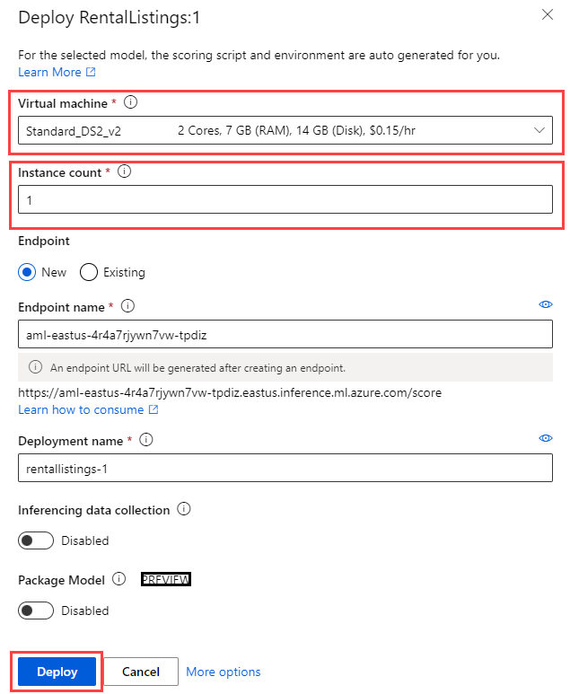
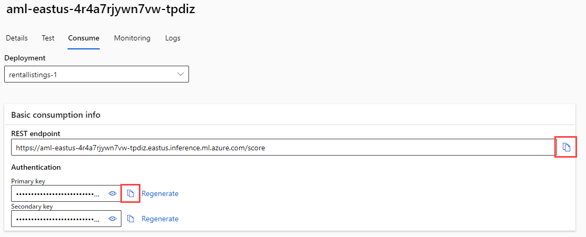

---
lab:
  title: Durchführen eines Rückschlusses mit Azure Machine Learning
  module: Use Azure Machine Learning Inferencing with Azure Database for PostgreSQL
---

# Durchführen eines Rückschlusses mit Azure Machine Learning

Als leitende Entwicklerin bzw. leitender Entwickler für Margie's Travel (MT) wurden Sie gebeten, bei der Entwicklung einer Funktion zur Schätzung der nächtlichen Mietpreise für Kurzzeitvermietungen zu helfen. Sie haben einige historische Daten als Textdatei gesammelt und möchten diese verwenden, um ein einfaches Regressionsmodell in Azure Machine Learning zu trainieren. Dann möchten Sie dieses Modell gegen Daten verwenden, die Sie in einer Azure Database for PostgreSQL – Flexibler Serverdatenbank gehostet haben.

In dieser Übung werden Sie ein Modell bereitstellen, das mit der Funktion für automatisiertes maschinelles Lernen von Azure Machine Learning erstellt wurde. Dann werden Sie dieses Modell verwenden, um die nächtlichen Verkaufspreise für Kurzzeitmietobjekte zu schätzen.

## Vor der Installation

Sie benötigen ein [Azure-Abonnement](https://azure.microsoft.com/free) mit Administratorrechten.

### Bereitstellen von Ressourcen in Ihrem Azure-Abonnement

Dieser Schritt führt Sie durch die Verwendung von Azure CLI-Befehlen aus der Azure Cloud Shell, um eine Ressourcengruppe zu erstellen und ein Bicep-Skript auszuführen, um die Azure-Services, die für die Durchführung dieser Übung erforderlich sind, in Ihrem Azure-Abonnement bereitzustellen.

1. Öffnen Sie einen Webbrowser, und navigieren Sie zum [Azure-Portal](https://portal.azure.com/).

2. Wählen Sie das Symbol **Cloud Shell** in der Symbolleiste des Azure-Portals aus, um einen neuen [Cloud Shell](https://learn.microsoft.com/azure/cloud-shell/overview)-Bereich am unteren Rand Ihres Browserfensters zu öffnen.

    

    Wählen Sie bei Aufforderung die erforderlichen Optionen aus, um eine *Bash*-Shell zu öffnen. Wenn Sie zuvor eine *PowerShell*-Konsole verwendet haben, wechseln Sie zu einer *Bash*-Shell.

3. Geben Sie an der Cloud Shell-Eingabeaufforderung Folgendes ein, um das GitHub-Repository mit den Übungsressourcen zu klonen:

    ```bash
    git clone https://github.com/MicrosoftLearning/mslearn-postgresql.git
    ```

    Wenn Sie dieses GitHub-Repositorium bereits in einem früheren Modul geklont haben, steht es Ihnen weiterhin zur Verfügung und Sie erhalten möglicherweise die folgende Fehlermeldung:

    ```bash
    fatal: destination path 'mslearn-postgresql' already exists and is not an empty directory.
    ```

    Wenn Sie diese Meldung erhalten, können Sie bedenkenlos mit dem nächsten Schritt fortfahren.

4. Als Nächstes führen Sie drei Befehle aus, um Variablen zu definieren und so die redundante Eingabe zu reduzieren, wenn Sie Azure-CLI-Befehle zum Erstellen von Azure-Ressourcen verwenden. Die Variablen stehen für den Namen, den Sie Ihrer Ressourcengruppe zuweisen (`RG_NAME`), für die Azure-Region (`REGION`), in der die Ressourcen bereitgestellt werden und für ein zufällig generiertes Kennwort für den PostgreSQL-Administrator-Login (`ADMIN_PASSWORD`).

    Im ersten Befehl ist die Region, die der entsprechenden Variablen zugewiesen ist, `eastus`, aber Sie können sie auch durch einen Ort Ihrer Wahl ersetzen. Wenn Sie jedoch die Standardeinstellung ersetzen, müssen Sie eine andere [Azure-Region auswählen, die die abstrakte Zusammenfassung unterstützt](https://learn.microsoft.com/azure/ai-services/language-service/summarization/region-support), um sicherzustellen, dass Sie alle Aufgaben in den Modulen in diesem Lernpfad erledigen können.

    ```bash
    REGION=eastus
    ```

    Mit dem folgenden Befehl weisen Sie den Namen für die Ressourcengruppe zu, die alle in dieser Übung verwendeten Ressourcen enthalten wird. Der Name der Ressourcengruppe, der der entsprechenden Variablen zugewiesen ist, lautet `rg-learn-postgresql-ai-$REGION`, wobei `$REGION` der Ort ist, den Sie oben angegeben haben. Sie können den Namen jedoch auch in einen anderen Namen für die Ressourcengruppe ändern, der Ihren Wünschen entspricht.

    ```bash
    RG_NAME=rg-learn-postgresql-ai-$REGION
    ```

    Der letzte Befehl generiert nach dem Zufallsprinzip ein Kennwort für das PostgreSQL-Admin-Login. Stellen Sie sicher, dass Sie es an einen sicheren Ort kopieren, um es später für die Verbindung zu Ihrem flexiblen PostgreSQL-Server zu verwenden.

    ```bash
    a=()
    for i in {a..z} {A..Z} {0..9}; 
       do
       a[$RANDOM]=$i
    done
    ADMIN_PASSWORD=$(IFS=; echo "${a[*]::18}")
    echo "Your randomly generated PostgreSQL admin user's password is:"
    echo $ADMIN_PASSWORD
    ```

5. Wenn Sie Zugriff auf mehr als ein Azure-Abonnement haben und Ihr Standardabonnement nicht dasjenige ist, in dem Sie die Ressourcengruppe und andere Ressourcen für diese Übung erstellen möchten, führen Sie diesen Befehl aus, um das entsprechende Abonnement festzulegen. Ersetzen Sie dabei das Token `<subscriptionName|subscriptionId>` durch den Namen oder die ID des Abonnements, das Sie verwenden möchten:

    ```azurecli
    az account set --subscription <subscriptionName|subscriptionId>
    ```

6. Führen Sie den folgenden Azure CLI-Befehl aus, um Ihre Ressourcengruppe zu erstellen:

    ```azurecli
    az group create --name $RG_NAME --location $REGION
    ```

7. Verwenden Sie schließlich die Azure CLI, um ein Bicep-Bereitstellungsskript auszuführen, um Azure-Ressourcen in Ihrer Ressourcengruppe bereitzustellen:

    ```azurecli
    az deployment group create --resource-group $RG_NAME --template-file "mslearn-postgresql/Allfiles/Labs/Shared/deploy-azure-machine-learning.bicep" --parameters adminLogin=pgAdmin adminLoginPassword=$ADMIN_PASSWORD
    ```

    Das Bicep-Bereitstellungsskript stellt die für diese Übung erforderlichen Azure-Service in Ihrer Ressourcengruppe bereit. Zu den bereitgestellten Ressourcen gehören ein Azure Database for PostgreSQL – Flexibler Server und ein Azure Machine Learning Workspace. Das Bereitstellungsskript erstellt auch alle erforderlichen Dienste für die Einrichtung eines Azure Machine Learning-Arbeitsbereichs, einschließlich eines Azure Blob Storage-Kontos, eines Azure Key Vault, eines Azure Container Repository, eines Azure Log Analytics-Arbeitsbereichs und einer Instanz von Azure Application Insights. Das Bicep-Skript führt auch einige Konfigurationsschritte aus, z. B. das Hinzufügen der Erweiterungen `azure_ai` und `vector` zur _Positivliste_ des PostgreSQL-Servers (über den Serverparameter azure.extensions) und das Erstellen einer Datenbank namens `rentals` auf dem Server. **Beachten Sie, dass sich die Bicep-Datei von den anderen Modulen in diesem Lernpfad unterscheidet.**

    Die Bereitstellung dauert in der Regel mehrere Minuten. Sie können es von der Cloud Shell aus überwachen oder zur Seite **Bereitstellungen** für die oben erstellte Ressourcengruppe navigieren und dort den Bereitstellungsfortschritt beobachten.

8. Schließen Sie den Cloud Shell-Bereich, sobald Ihre Ressourcenbereitstellung abgeschlossen ist.

### Problembehandlung bei der Bereitstellung

Beim Ausführen des Bicep-Bereitstellungsskripts können einige Fehler auftreten.

- Wenn Sie zuvor das Bicep-Bereitstellungsskript für diesen Lernpfad ausgeführt und anschließend die Ressourcen gelöscht haben, erhalten Sie möglicherweise eine Fehlermeldung wie die folgende, wenn Sie versuchen, das Skript innerhalb von 48 Stunden nach dem Löschen der Ressourcen erneut auszuführen:

    ```bash
    {"code": "InvalidTemplateDeployment", "message": "The template deployment 'deploy' is not valid according to the validation procedure. The tracking id is '4e87a33d-a0ac-4aec-88d8-177b04c1d752'. See inner errors for details."}
    
    Inner Errors:
    {"code": "FlagMustBeSetForRestore", "message": "An existing resource with ID '/subscriptions/{subscriptionId}/resourceGroups/rg-learn-postgresql-ai-eastus/providers/Microsoft.CognitiveServices/accounts/{accountName}' has been soft-deleted. To restore the resource, you must specify 'restore' to be 'true' in the property. If you don't want to restore existing resource, please purge it first."}
    ```

    Wenn Sie diese Meldung erhalten, ändern Sie den obigen Befehl `azure deployment group create`, um den Parameter `restore` auf `true` zu setzen und führen Sie ihn erneut aus.

- Wenn die ausgewählte Region für die Bereitstellung bestimmter Ressourcen eingeschränkt ist, müssen Sie die Variable `REGION` auf einen anderen Speicherort setzen und die Befehle erneut ausführen, um die Ressourcengruppe zu erstellen und das Bicep-Bereitstellungsskript auszuführen.

    ```bash
    {"status":"Failed","error":{"code":"DeploymentFailed","target":"/subscriptions/{subscriptionId}/resourceGroups/{resourceGrouName}/providers/Microsoft.Resources/deployments/{deploymentName}","message":"At least one resource deployment operation failed. Please list deployment operations for details. Please see https://aka.ms/arm-deployment-operations for usage details.","details":[{"code":"ResourceDeploymentFailure","target":"/subscriptions/{subscriptionId}/resourceGroups/{resourceGrouName}/providers/Microsoft.DBforPostgreSQL/flexibleServers/{serverName}","message":"The resource write operation failed to complete successfully, because it reached terminal provisioning state 'Failed'.","details":[{"code":"RegionIsOfferRestricted","message":"Subscriptions are restricted from provisioning in this region. Please choose a different region. For exceptions to this rule please open a support request with Issue type of 'Service and subscription limits'. See https://review.learn.microsoft.com/en-us/azure/postgresql/flexible-server/how-to-request-quota-increase for more details."}]}]}}
    ```

- Wenn das Skript aufgrund der Anforderung, die Vereinbarung über die verantwortungsvolle KI zu akzeptieren, keine KI-Ressource erstellen kann, kann der folgende Fehler auftreten. Verwenden Sie in diesem Fall die Benutzeroberfläche des Azure-Portals, um eine Azure-KI-Services-Ressource zu erstellen und führen Sie das Bereitstellungsskript dann erneut aus.

    ```bash
    {"code": "InvalidTemplateDeployment", "message": "The template deployment 'deploy' is not valid according to the validation procedure. The tracking id is 'f8412edb-6386-4192-a22f-43557a51ea5f'. See inner errors for details."}
     
    Inner Errors:
    {"code": "ResourceKindRequireAcceptTerms", "message": "This subscription cannot create TextAnalytics until you agree to Responsible AI terms for this resource. You can agree to Responsible AI terms by creating a resource through the Azure Portal then trying again. For more detail go to https://go.microsoft.com/fwlink/?linkid=2164190"}
    ```

## Bereitstellen eines Azure Machine Learning-Modells

Der erste Schritt ist die Bereitstellung eines Modells in Azure Machine Learning. Das Repository enthält ein Beispiel für ein Modell, das auf einem Satz von Auflistungsdaten trainiert wurde, die Sie in Ihrer PostgreSQL-Integration verwenden werden.

1. Laden Sie die `mlflow-model.zip`-Datei aus [dem mslearn-postgresql Repository](../../Allfiles/Labs/Shared/mlflow-model.zip) herunter. Extrahieren Sie die Dateien daraus in einen Ordner namens **mlflow-model**.

2. Navigieren Sie im [Azure-Portal](https://portal.azure.com/) zu Ihrem neu erstellten Azure Machine Learning-Arbeitsbereich.

3. Wählen Sie die Schaltfläche **Studio starten**, um das Azure Machine Learning Studio zu öffnen.

    

4. Wählen Sie die Menüoption **Arbeitsbereiche** und wählen Sie Ihren neu erstellten Azure Machine Learning-Arbeitsbereich.

    

5. Wählen Sie die Menüoption **Modelle** aus dem Menü **Assets**. Wählen Sie dann die Menüoption **+ Registrieren** und wählen Sie **Aus lokalen Dateien**.

    

6. Stellen Sie im Menü **Modell hochladen** den Modelltyp auf **MLflow**. Wählen Sie dann **Durchsuchen** und navigieren Sie zu Ihrem Ordner **mlflow-model** und laden Sie die Assets hoch. Wählen Sie danach die Schaltfläche **Weiter**, um fortzufahren.

    

7. Nennen Sie das Modell **Mietlisten** und wählen Sie dann die Schaltfläche **Weiter**.

    

8. Wählen Sie die Schaltfläche **Registrieren**, um die Modellregistrierung abzuschließen. Diese Aktion bringt Sie zurück zur Seite **Modelle**. Wählen Sie das neu erstellte Modell aus.

    > [!Note]
    >
    > Wenn Sie kein Modell sehen, wählen Sie die Menüoption **Neu laden**, um die Seite neu zu laden. Danach sollten Sie das Modell **Mietlisten** sehen.

9. Wählen Sie die Option **Bereitstellen** und erstellen Sie einen neuen **Echtzeitendpunkt**.

    

10. Setzen Sie im Flyout-Menü für die Bereitstellung die **Virtuelle Maschine** auf etwas wie **Standard_DS2_v2** und die **Instanzanzahl** auf 1. Wählen Sie die Schaltfläche **Bereitstellen** aus. Das Bereitstellen kann einige Minuten in Anspruch nehmen, da der Bereitstellungsprozess die Bereitstellung einer virtuellen Maschine und die Bereitstellung des Modells als Docker-Container umfasst.

    

11. Nachdem der Endpunkt bereitgestellt wurde, navigieren Sie zur Registerkarte **Verbrauchen** und kopieren den REST-Endpunkt und den Primärschlüssel, damit Sie sie im nächsten Abschnitt verwenden können.

    

12. Um zu testen, ob Ihr Endpunkt korrekt läuft, können Sie die Registerkarte **Test** auf Ihrem Endpunkt anwenden. Fügen Sie dann den folgenden Block ein und ersetzen Sie dabei alle bereits vorhandenen Eingaben. Klicken Sie auf die Schaltfläche **Test**, und Sie sollten eine JSON-Ausgabe sehen, die ein Array mit einem einzigen Dezimalwert enthält, der die den US-Dollar-Betrag angibt, den Sie für eine einzelne Mietnacht für dieses bestimmte Objekt erwarten können.

    ```json
    {
        "input_data": {
            "columns": [
                "host_is_superhost",
                "host_has_profile_pic",
                "host_identity_verified",
                "neighbourhood_group_cleansed",
                "zipcode",
                "property_type",
                "room_type",
                "accommodates",
                "bathrooms",
                "bedrooms",
                "beds"
            ],
            "index": [0],
            "data": [["0", "0", "0", "Central Area", "98122", "House", "Entire home/apt", 4, 1.5, 3, 3]]
        }
    }
    ```

    

## Verbinden Sie sich mit Ihrer Datenbank mit psql in der Azure Cloud Shell

In dieser Aufgabe verbinden Sie sich mit der `rentals`-Datenbank auf Ihrem Azure Database for PostgreSQL – Flexibler Server mit dem [psql Befehlszeilen-Dienstprogramm](https://www.postgresql.org/docs/current/app-psql.html) von der [Azure Cloud Shell](https://learn.microsoft.com/azure/cloud-shell/overview) aus.

1. Navigieren Sie im [Azure-Portal](https://portal.azure.com/) zu Ihrem neu erstellten Azure Database for PostgreSQL – Flexibler Server.

2. Wählen Sie im Ressourcenmenü unter **Einstellungen** die Option **Datenbanken** und dann **Verbinden** für die Datenbank `rentals`.

    

3. Geben Sie bei der Eingabeaufforderung „Kennwort für den Benutzer pgAdmin“ in der Cloud Shell das zufällig generierte Kennwort für die Anmeldung **pgAdmin** ein.

    Sobald Sie angemeldet sind, wird die Eingabeaufforderung `psql` für die Datenbank `rentals` angezeigt.

4. Im weiteren Verlauf dieser Übung arbeiten Sie weiterhin in der Cloud Shell. Daher kann es hilfreich sein, den Bereich in Ihrem Browserfenster zu erweitern, indem Sie die Schaltfläche **Maximieren** oben rechts im Bereich wählen.

    

## Installieren und konfigurieren Sie die `azure_ai`-Erweiterung

Bevor Sie die `azure_ai`-Erweiterung verwenden, müssen Sie sie in Ihrer Datenbank installieren und für die Verbindung mit Ihren Azure KI Services-Ressourcen konfigurieren. Mit der `azure_ai`-Erweiterung können Sie die Azure OpenAI und Azure KI Language-Services in Ihre Datenbank integrieren. Um die Erweiterung in Ihrer Datenbank zu aktivieren, gehen Sie folgendermaßen vor:

1. Führen Sie den folgenden Befehl an der `psql`-Eingabeaufforderung aus, um zu überprüfen, ob die `azure_ai`- und die `vector`-Erweiterungen durch das Bicep-Bereitstellungsskript, das Sie beim Einrichten Ihrer Umgebung ausgeführt haben, erfolgreich zur _Positivliste_ Ihres Servers hinzugefügt wurden:

    ```sql
    SHOW azure.extensions;
    ```

    Der Befehl zeigt die Liste der Erweiterungen in der _Positivliste_ des Servers an. Wenn alles korrekt installiert wurde, muss Ihre Ausgabe `azure_ai` und `vector` enthalten, etwa so:

    ```sql
     azure.extensions 
    ------------------
     azure_ai,vector
    ```

    Bevor eine Erweiterung in Azure Database for PostgreSQL – Flexibler Server installiert und verwendet werden kann, muss sie zur _Positivliste_ des Servers hinzugefügt werden, wie in [Wie man PostgreSQL-Erweiterungen verwendet](https://learn.microsoft.com/azure/postgresql/flexible-server/concepts-extensions#how-to-use-postgresql-extensions) beschrieben.

2. Jetzt können Sie die `azure_ai`-Erweiterung mit dem Befehl [CREATE EXTENSION](https://www.postgresql.org/docs/current/sql-createextension.html) installieren.

    ```sql
    CREATE EXTENSION IF NOT EXISTS azure_ai;
    ```

    `CREATE EXTENSION` lädt eine neue Erweiterung in die Datenbank, indem die zugehörige Skriptdatei ausgeführt wird. Dieses Skript erstellt normalerweise neue SQL-Objekte wie Funktionen, Datentypen und Schemata. Es wird ein Fehler ausgegeben, wenn eine Erweiterung mit demselben Namen bereits existiert. Durch Hinzufügen von `IF NOT EXISTS` kann der Befehl ausgeführt werden, ohne dass eine Fehlermeldung ausgegeben wird, wenn er bereits installiert ist.

3. Sie müssen dann die Funktion `azure_ai.set_setting()` verwenden, um die Verbindung zu Ihrem bereitgestellten Azure Machine Learning Endpunkt zu konfigurieren. Konfigurieren Sie die `azure_ml`-Einstellungen so, dass sie auf Ihren bereitgestellten Endpunkt und seinen Schlüssel verweisen. Der Wert für `azure_ml.scoring_endpoint` wird die REST-URL Ihres Endpunkts sein. Der Wert für `azure_ml.endpoint_key` ist der Wert von Schlüssel 1 oder Schlüssel 2.

    ```sql
    SELECT azure_ai.set_setting('azure_ml.scoring_endpoint','https://<YOUR_ENDPOINT>.<YOUR_REGION>.inference.ml.azure.com/score');
    ```

    ```sql
    SELECT azure_ai.set_setting('azure_ml.endpoint_key', '<YOUR_KEY>');
    ```

## Erstellen Sie eine Tabelle mit Angeboten zum Preis

Sie benötigen eine Tabelle zum Speichern von Kurzzeitmietangeboten, die Sie bepreisen möchten.

1. Führen Sie den folgenden Befehl in der Datenbank `rentals` aus, um eine neue Tabelle `listings_to_price` zu erstellen.

    ```sql
    CREATE TABLE listings_to_price (
        id INT GENERATED BY DEFAULT AS IDENTITY PRIMARY KEY,
        host_is_superhost INT NOT NULL,
        host_has_profile_pic INT NOT NULL,
        host_identity_verified INT NOT NULL,
        neighbourhood_group_cleansed VARCHAR(75) NOT NULL,
        zipcode VARCHAR(5) NOT NULL,
        property_type VARCHAR(30) NOT NULL,
        room_type VARCHAR(30) NOT NULL,
        accommodates INT NOT NULL,
        bathrooms DECIMAL(3,1) NOT NULL,
        bedrooms INT NOT NULL,
        beds INT NOT NULL
    );
    ```

2. Als nächstes führen Sie den folgenden Befehl in der `rentals`-Datenbank aus, um neue Mietdaten einzufügen.

    ```sql
    INSERT INTO listings_to_price(host_is_superhost, host_has_profile_pic, host_identity_verified,
        neighbourhood_group_cleansed, zipcode, property_type, room_type,
        accommodates, bathrooms, bedrooms, beds)
    VALUES
        (1, 1, 1, 'Queen Anne', '98119', 'House', 'Private room', 2, 1.0, 1, 1),
        (0, 1, 1, 'University District', '98105', 'Apartment', 'Entire home/apt', 4, 1.5, 2, 2),
        (0, 0, 0, 'Central Area', '98122', 'House', 'Entire home/apt', 4, 1.5, 3, 3),
        (0, 0, 0, 'Downtown', '98101', 'House', 'Entire home/apt', 4, 1.5, 3, 3),
        (0, 0, 0, 'Capitol Hill', '98122', 'House', 'Entire home/apt', 4, 1.5, 3, 3);
    ```

    Dieser Befehl fügt fünf Zeilen mit neuen Listendaten ein.

## Erstellen Sie eine Funktion zum Übersetzen von Auflistungsdaten

Um die Tabelle mit den Sprachübersetzungen aufzufüllen, erstellen Sie eine gespeicherte Prozedur, mit der Sie Daten in Stapeln laden können.

1. Führen Sie den folgenden Befehl an der Eingabeaufforderung `psql` aus, um eine neue Funktion namens `price_listing` zu erstellen.

    ```sql
    CREATE OR REPLACE FUNCTION price_listing (
        IN host_is_superhost INT, IN host_has_profile_pic INT, IN host_identity_verified INT,
        IN neighbourhood_group_cleansed VARCHAR(75), IN zipcode VARCHAR(5), IN property_type VARCHAR(30),
        IN room_type VARCHAR(30), IN accommodates INT, IN bathrooms DECIMAL(3,1), IN bedrooms INT, IN beds INT)
    RETURNS DECIMAL(6,2)
    AS $$
        SELECT CAST(jsonb_array_elements(inference.inference) AS DECIMAL(6,2)) AS expected_price
        FROM azure_ml.inference(('
        {
            "input_data": {
                "columns": [
                    "host_is_superhost",
                    "host_has_profile_pic",
                    "host_identity_verified",
                    "neighbourhood_group_cleansed",
                    "zipcode",
                    "property_type",
                    "room_type",
                    "accommodates",
                    "bathrooms",
                    "bedrooms",
                    "beds"
                ],
                "index": [0],
                "data": [["' || host_is_superhost || '", "' || host_has_profile_pic || '", "' || host_identity_verified || '", "' ||
                neighbourhood_group_cleansed || '", "' || zipcode || '", "' || property_type || '", "' || room_type || '", ' ||
                accommodates || ', ' || bathrooms || ', ' || bedrooms || ', ' || beds || ']]
            }
        }')::jsonb, deployment_name=>'rentallistings-1');
    $$ LANGUAGE sql;
    ```

    > [!Note]
    >
    > Standardmäßig ist der Bereitstellungsname eine Kombination aus dem Modellnamen (**Mietlisten**) und der Versionsnummer (**1**). Wenn Sie eine neue Version des Modells bereitstellen und den Standard-Bereitstellungsnamen verwenden, würde der neue Bereitstellungsname **mietlisten-2** lauten.

2. Führen Sie die Funktion mit dem folgenden SQL-Befehl aus:

    ```sql
    SELECT * FROM price_listing(0, 0, 0, 'Central Area', '98122', 'House', 'Entire home/apt', 4, 1.5, 3, 3);
    ```

    Diese Abfrage gibt eine nächtliche Mietpreisschätzung im Dezimalformat zurück.

3. Rufen Sie die Funktion für jede Zeile in der Tabelle `listings_to_price` mit dem folgenden SQL-Befehl auf:

    ```sql
    SELECT l2p.*, expected_price
    FROM listings_to_price l2p
        CROSS JOIN LATERAL price_listing(l2p.host_is_superhost, l2p.host_has_profile_pic, l2p.host_identity_verified,
            l2p.neighbourhood_group_cleansed, l2p.zipcode, l2p.property_type, l2p.room_type,
            l2p.accommodates, l2p.bathrooms, l2p.bedrooms, l2p.beds) expected_price;
    ```

    Diese Abfrage gibt fünf Zeilen zurück, eine für jede Zeile in `listings_to_price`. Sie wird alle Spalten der Tabelle `listings_to_price` und das Ergebnis der Funktion `price_listing()` als `expected_price` enthalten.

## Bereinigung

Sobald Sie diese Übung abgeschlossen haben, löschen Sie die von Ihnen erstellten Azure-Ressourcen. Sie zahlen für die konfigurierte Kapazität, nicht dafür, wie viel die Datenbank genutzt wird. Folgen Sie diesen Anweisungen, um Ihre Ressourcengruppe und alle Ressourcen, die Sie für dieses Lab erstellt haben, zu löschen.

1. Öffnen Sie einen Webbrowser und navigieren Sie zum [Azure-Portal](https://portal.azure.com/). Wählen Sie auf der Startseite die Option **Ressourcengruppen** unter „Azure-Services“ aus.

    

2. Geben Sie in das Suchfeld Filter für ein beliebiges Feld den Namen der Ressourcengruppe ein, die Sie für dieses Lab erstellt haben und wählen Sie dann die Ressourcengruppe aus der Liste aus.

3. Wählen Sie auf der Seite **Übersicht** der Ressourcengruppe die Option **Ressourcengruppe löschen** aus.

    

4. Geben Sie im Bestätigungsdialog zur Bestätigung den Namen der Ressourcengruppe ein, die Sie löschen möchten und wählen Sie dann **Löschen**.
